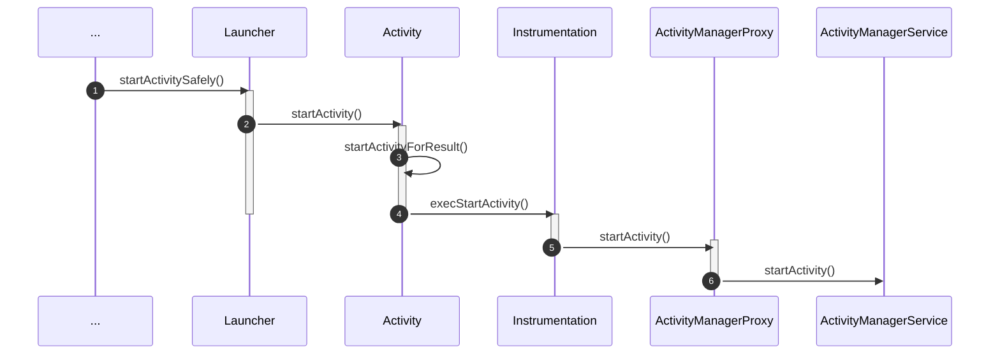
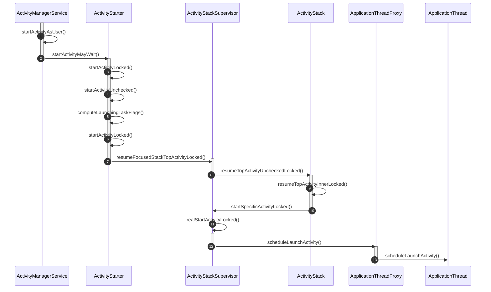
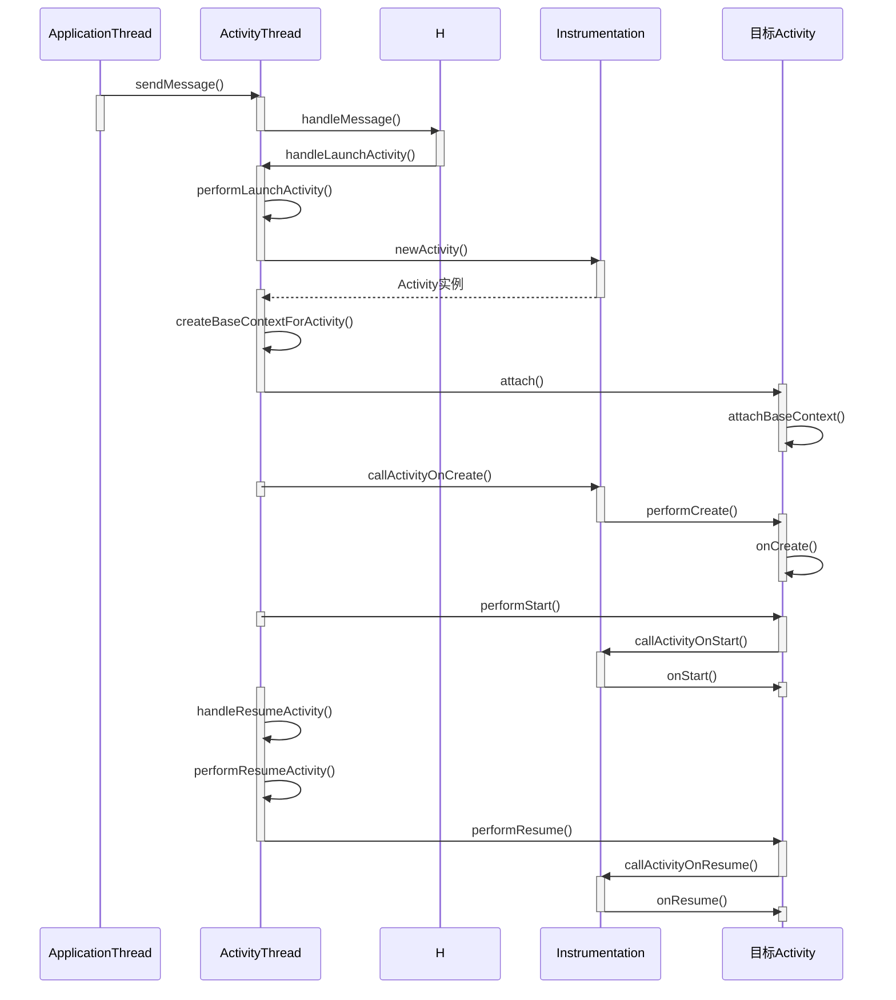

# Android源码

## Init进程的启动过程

[Android系统启动流程（一）解析init进程启动过程](http://liuwangshu.cn/framework/booting/1-init.html)

引导芯片代码 -> 加载Bootloader到RAM执行 -> Linux内核启动 -> init进程启动 init.cpp main()

* 创建一些文件夹并挂载设备
* property_init 初始化属性，start_property_service启动属性服务
* 解析 init.rc、init.zygote32(64).rc

-> builtins.cpp do_class_start() 

* fork 子进程
* app_main.cpp main()
* AndroidRuntime.start("com.android.internal.os.ZygoteInit",, args, zygote)

## Zygote进程启动

[Android系统启动流程（二）解析Zygote进程启动过程](http://liuwangshu.cn/framework/booting/2-zygote.html)

AndroidRuntime.start(）

* startVm() 启动 JavaVM(Dalvik、ART) 虚拟机
* startReg() 为虚拟机注册JNI
* 通过 JNI 调用 ZygoteInit.java 的 main()，从此进 Java 的世界

 ZygoteInit.java main()

* registerZygoteSocket(), 创建Server端的监听Socket
  * 创建sServerSocket (LocalServerSocket)  
* preload()，预加载一些常用的类和资源
* startSystemServer() 启动系统服务
  * Zygote.forkSystemServer() (uid gid设置为1000)
  * ZygoteInit.handleSystemServerProcess 启动SystemServer进程
* runSelectLoop() 等待客户端连接(AMS 请求 Zygote 创建新的应用程序进程)

## SystemServer进程启动

[Android系统启动流程（三）解析SyetemServer进程启动过程](http://liuwangshu.cn/framework/booting/3-syetemserver.html)

ZygoteInit.java startSystemServer()

* Zygote.forkSystemServer()： fork SystemServer进程
* handleSystemServerProcess() ：closeServerSocket()关闭从Zygote进程复制来的Socket；SystemServer进程启动之后的工作

RuntimeInit.zygoteInit：

* nativeZygoteInit()：
  * AndroidRuntime.cpp com_android_internal_os_RuntimeInit_nativeZygoteInit()
  * AppRuntime.onZygoteInit()
  * ProcessState.startThreadPool()：启动一个Binder线程池，这样SyetemServer进程就可以使用
Binder来与其他进程进行通信了
* applicationInit()

## Activity的启动过程

冷启动，点击 Launcher 应用图标进入 APP 时序图：

Instrumentation：类负责监控系统与应用之间的所有交互

ActivityManagerProxy: 即 *ActivityManagerNative.getDefault()* ，是 AMS 在应用进程的 Binder 代理对象。

* ActivityRecord：系统服务中的 Activity 实例
* TaskRecord：Activity任务栈，内部维护了一个 ActivityRecord 的列表
* ActivityStack：内部维护了一个 TaskRecord 的列表，方便管理所有的 TaskRecord；一般来说Launcher的Task属于单独的一个ActivityStack，称为mHomeStack，System UI如rencentActivity的Task属于一个单独ActivityStack，其他App的Task属于另一个ActivityStack
* ActivityManagerService：启动 Activity 的核心系统服务，ActivityStarter 负责启动，ActivityStackSupervisor 负责管理 ActivityStack，ActivityStack 负责管理 TaskRecord 和 ActivityRecord
* startActivityMayWait：通过 PMS 根据 Intent 获取 Activity 的启动信息 (ResolveInfo和ActivityInfo), 获取调用者的 Pid 和 Uid
* startActivityLocked： 创建ActivityRecord, 含有 Activity 的核心信息
* startActivityUnchecked：根据启动的 Flag 信息以及启动模式, 设置 TaskRecord, 完成后执行
* startSpecificActivityLocked：判断当前应用进程是否创建，没有创建则 AMS 跟 Zygote 通过 Socket 的方式新建进程
* scheduleLaunchActivity: 系统服务通过 Binder 代理对象 ApplicationThreadProxy 远程调用应用进程的 ApplicationThread（ActivityThread的内部类）

* ApplicationThread接收到 AMS 的远程调用，然后把事件抛给 ActivityThread 的 H（Handler）对象，H.handleMessage() 调用 ActivityThread 的方法（例如 handleLaunchActivity()）顺序处理这些事件，并最终通过 Instrumentation 依次回调目标 Activity 的生命周期方法
* createBaseContextForActivity: 创建 ContextImpl 对象，
* Activity.sttach(): 内部调用 Activity（ContextThemeWrapper）的 attachBaseContext() 方法，将创建的 ContextImpl  对象设置为 Activity（ContextWrapper）的 mBase 属性；内部创建 PhoneWindow 对象

