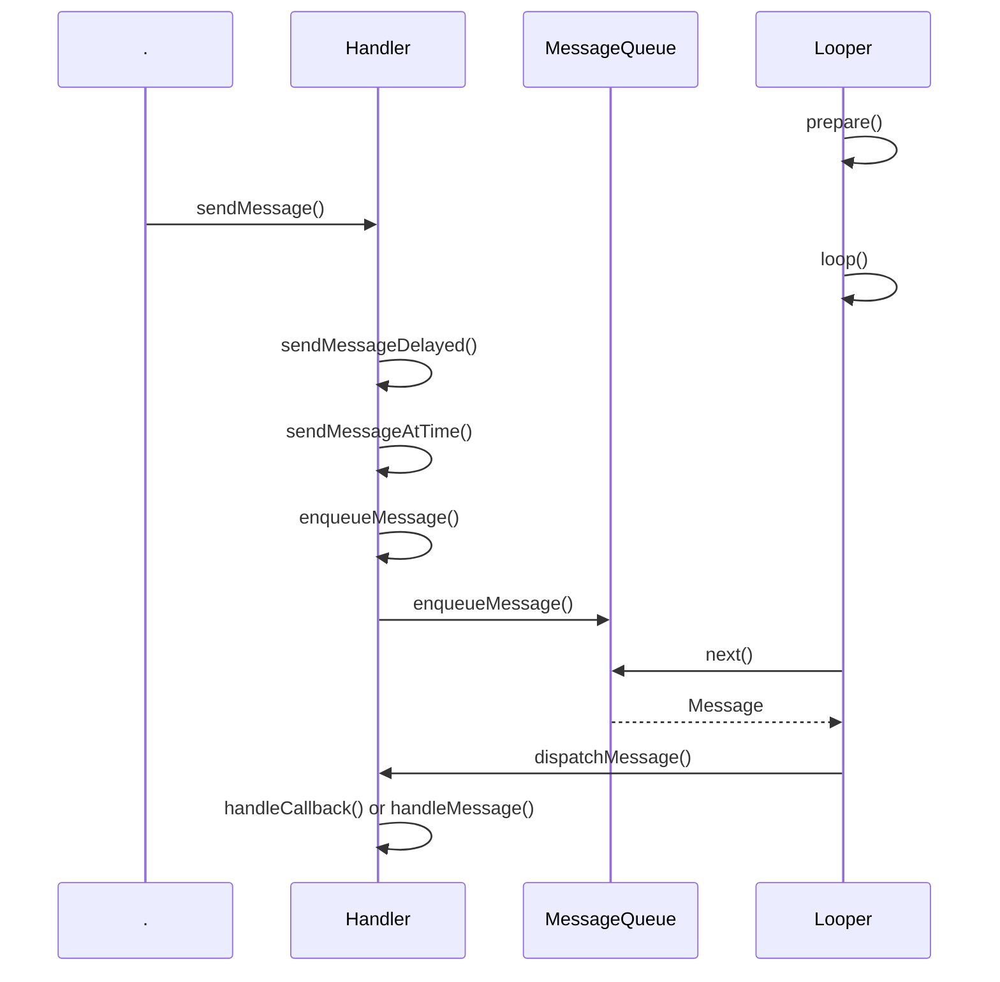

# Android

## Activity
### 生命周期


onRestart可以代替onResume做一些数据刷新的操作。

onStart和onStop：是否可见的角度。onStart代表即将可见，但是用户不能与之交互；onStop代表完全不可见

onPause和onResume：是否处于前台，用户可与之交互的角度。例如 A Activity 启动一个 windowIsFloating 或者 windowIsTranslucent 主题的 B Activity时，A只会回调 onPause，不会进入 onStop，因为此时 A Activity 还是部分可见的，但是用户不能与之交互。

先启动A: A.onCreate() -> A.onStart() -> A.onResume()

再从A中启动B: A.onPause() -> B.onCreate() -> B.onStart() -> B.onResume() -> A.onStop()

按返回键从B回到A：B.onPause() -> A.onRestart() -> A.onStart() -> A.onResume() -> B.onStop() -> B.onDestroy()

从 A 启动 B 时，首先 A onPause() ，此时用户无法与A交互了，然后 B 依次 onCreate() -> onStart()->onResume()，此时 B 可见且可以交互了，所以  A 完全不可见进入 onStop() 

onWindowFocusChanged()：Activity获取或失去焦点时的回调，例如在 Activity 中拉下系统状态面板，则 Activity 会失去焦点，再拉上去又回重新获取到焦点。可以在这个回调中获取View的宽高

onContentChanged()：setContentView()或者addContentView()方法执行导致Activity的View发生变化时回调

onPostCreate()/onPostResume(): onPostCreate() 在 onStart() 之后，onPostResume() 在 onResume() 之后。

[Android onSaveInstanceState()和onRestoreInstanceState()调用时机](https://blog.csdn.net/fenggering/article/details/53907654)

[Android 横竖屏切换](https://www.jianshu.com/p/dbc7e81aead2)：从Android 3.2开始，横竖屏切换时，screenSize也会发生变化，所以需要配置 "android:configChanges="orientation|screenSize"，Activity才不会重启，只会回调 onConfigurationChanged() 方法

监听 Home 按键：监听 "android.intent.action.CLOSE_SYSTEM_DIALOGS" 广播，获取 "reason" 字段携带的值，判断是 多任务案按键 还是 home 按键；

onUserLeaveHint() / onUserInteraction()：举例：按下 home 按键或者或者启动一个新的 Activity，则当前Activity会回调 onUserLeaveHint() 方法

为何调用 finish() 之后 onStop() /onDestroy() 会延迟10s执行：

当前 Activity 调用 finish() 之后，首先跨进程调用 AMS 的 finishActivity() 方法，AMS 通过 ApplicationThread.schedulePauseActivity() 再回调到 APP 进程，在 ActivityThread 里面调用当前 Activity 的 onPause()，然后又跨进程通知 AMS.activityPaused()，在 AMS 进程把当前 Activity 放到要销毁的集合里面，然后通过 ApplicationThread.scheduleResumeActivity() 回到 APP 进程通知下一个 Activity onResume()，在 ActivityThread .handleResumeActivity() 里面主线程addIdleHandler，等空闲状态时才会通知 AMS 去执行后续当前 Activity 的 onStop/onDestroy()，所以如果下一个 Activity 一直在主线程的 Looper 抛事件，则当前 Activity 的  onStop/onDestroy() 就一直得不到执行的机会。但是 AMS 有个超时机制，在通知下一个 Activity onResume() 之前，会抛出一个延时 IDLE_TIMEOUT（10s）的 IDLE_TIMEOUT_MSG 事件，如果一直等不到下一个 Activity 的 idel 空闲通知，则会强制去 stop/destroy() 当前 Activity。


### Intent

显式Intent

隐式Intent

为了确保应用的安全性，启动 `Service` 时，请始终使用显式 Intent，且不要为服务声明 Intent 过滤器

Intent Filter匹配规则

action：一个Intent Filter中可声明多个action，Intent中的action与其中的任一个action在字符串形式上完全相同（注意，区分大小写，大小写不同但字符串内容相同也会造成匹配失败），action方面就匹配成功。隐式Intent必须指定action（如不指定action则必须指定data或mimetype，这种情况下，只要IntentFilter至少含有一个action就可以匹配）。

category：Intent中个如果含有category，那么所有的category都必须和过滤规则中的其中一个category相同；Intent中也可以没有category（若Intent中未指定category，系统会自动为它带上“android.intent.category.DEFAULT”，所以，如果你的 activity支持接收隐式intent的话就一定要在intent filter中加入android.intent.category.DEFAULT

data：URI完全匹配
* <scheme>://<host>:<port>/<path>  
* mimeType

```java
<intent-filter>
    <action android:name="android.intent.action.MAIN" />

    <category android:name="android.intent.category.LAUNCHER" />
</intent-filter>
```
这二者共同出现，标明该Activity是一个入口Activity，并且会出现在系统应用列表中，二者缺一不可。

### 启动模式
[解开Android应用程序组件Activity的"singleTask"之谜](https://blog.csdn.net/Luoshengyang/article/details/6714543)
[Android中Activity四种启动模式和taskAffinity属性详解](https://blog.csdn.net/zhangjg_blog/article/details/10923643)
1、针对 launchmode 为 SingleTask 的 Activity，代表该 Activity 可以通过创建新 task 的方式启动，但是是否真的创建新的 task，还有其他条件的限制，例如：需要指定与启动该Activity task 不同的 taskAffinity、不是通过 startActivityForResult 启动该 Activity
2、在启动一个singleTask的Activity实例时，如果系统中已经存在这样一个实例，就会将这个实例调度到任务栈的栈顶，并清除它当前所在任务中位于它上面的所有的activity
3、以singleInstance模式启动的Activity在整个系统中是单例的，如果在启动这样的Activity时，已经存在了一个实例，那么会把它所在的任务调度到前台，重用这个实例。
4、以singleInstance模式启动的Activity具有独占性，即它会独自占用一个任务，被他开启的任何activity都会运行在其他任务中
[ACTIVITY 的属性ANDROID:TASKAFFINITY和ANDROID:ALLOWTASKREPARENTING](https://www.cnblogs.com/androidxiaoyang/archive/2013/05/13/3075676.html)

android:allowTaskReparenting：如果一个 Activity 没有指定为 SingleTask 或者设置了 FLAG_ACTIVITY_NEW_TASK，则没有创建新 task 的能力，所以只能在启动它的 task 里面（例如A应用启动了B应用的某个Activity），如果此时一个具有跟该 Activity 相同 taskAffinity 的 task 进入前台，该属性值指定为 true 时，该 Activity 就会重新转移到这个 task 里面去。

android:alwaysRetainTaskState：task长时间处于后台，重新进入的时候是否会保留 task 里面的所有activity，默认是 false，代表会清除根Activity之外其他所有的Activity。该属性只对 task 的根 Activity 起作用。

android:clearTaskOnLaunch：当task重新进入前台时，是否清除除根 Activity 之外的所有 Activity ，默认是false。该属性只对 task 的根 Activity 起作用。

android:finishOnTaskLaunch：当task重新进入前台时，是否关闭该Activity，优先级比 allowTaskReparenting 高。对 task 中的所有 Activity 有效。

Intent.FLAG_ACTIVITY_CLEAR_TOP：如果task中存在对应activity的实例，例如A->B->C（都是标准启动模式），此时在启动一个A，则首先B.onDestroyed()->C.onPause()->A.onDestroy()->A重新创建->C.onStop()->C.onDestory()

Intent.FLAG_ACTIVITY_NEW_TASK：当启动一个activity时如果具有此标记位，代表新启动的app是可以创建一个新的task的，当然不一定会启动新的task，具体参考上面的 Singletask 模式

Intent.FLAG_ACTIVITY_SINGLE_TOP：如果task中栈顶是该activity的实例，则不会创建新的activity，会依次调用该activity的 onPause()->onNewIntent()->onResume()

SingleTask模式 = Intent.FLAG_ACTIVITY_NEW_TASK（能创建新的task ）+ Intent.FLAG_ACTIVITY_CLEAR_TOP + Intent.FLAG_ACTIVITY_SINGLE_TOP （task栈内复用）

### Context


[面试官灵魂发问：你真的懂 Context 吗？](https://blog.csdn.net/weixin_44339238/article/details/106123300)

ContextWrapper是上下文功能的封装类，而ContextImpl则是上下文功能的实现类，ContextWrapper装饰ContextImpl。而ContextWrapper又有三个直接的子类， ContextThemeWrapper、Service和Application。其中，ContextThemeWrapper是一个带主题的封装类，而它有一个直接子类就是Activity，所以Activity和Service以及Application的Context是不一样的，只有Activity需要主题，Service不需要主题。

getApplication()只能在activity、service里面调用，getApplicationContext()只要有Context的实例就能调用到 ccontext.getApplicationContext(); getBaseContext获取ContextWrapper里面包装的ContextImpl对象

Context的数量 = Activity的数量+Service的数量+1（Application）

非Activity的Context做一些 Activity Context 的操作：

* 非Activity的Context（ContextWrapper）启动Activity需要必须增加 Intent.FLAG_ACTIVITY_NEW_TASK 的Flag，因为非Activity的Context调用startActivity默认是调用了ContextImpl 的startActivity方法，内部有判断 Intent 是否包含Intent.FLAG_ACTIVITY_NEW_TASK，没有则抛出AndroidRuntimeException

* 非Activity的Context inflate layout 会使用系统默认的主题样式

* 非Activity的Context不能 show 普通的dialog（应用窗口类型1-99），WMS会校验token，返回对应的错误码，APP进程收到之后抛出 WindowManager.BadTokenException

  AMS 在启动 Activity 的时候，会构建表示 Activity 信息的 ActivityRecord 对象，其构造函数中会实例化 Token 对象

  AMS 在接着上一步之后，会利用创建的 Token 构建 AppWindowContainerController 对象，最终将 Token 存储到 WMS 中的 mTokenMap 中

  WMS 在 addWindow 时，会根据当前 Window 对象的 Token 进行校验

  ```java
   if (type >= FIRST_APPLICATION_WINDOW && type <= LAST_APPLICATION_WINDOW) {
                      Slog.w(TAG_WM, "Attempted to add application window with unknown token "
                            + attrs.token + ".  Aborting.");
                      return WindowManagerGlobal.ADD_BAD_APP_TOKEN;
                  }
  ```

  非Activity的Context parentWindow 为空所以不会调用 adjustLayoutParamsForSubWindow，从而引发 BadTokenException

在 View 中对 context 强转出现 ClassCastException：android.view.ContextThemeWrapper cannot be cast to Activity

```java
Dialog(@NonNull Context context, @StyleRes int themeResId, boolean createContextThemeWrapper) {
        if (createContextThemeWrapper) {
            if (themeResId == 0) {
                final TypedValue outValue = new TypedValue();
                context.getTheme().resolveAttribute(R.attr.dialogTheme, outValue, true);
                themeResId = outValue.resourceId;
            }
            mContext = new ContextThemeWrapper(context, themeResId);
        } else {
            mContext = context;
        }
        ......
    }
```

Dialog中的 Context 会被重新包装为 ContextThemeWrapper，所以 Dialog 中的 View 通过 getContext() 获取到的都是 ContextThemeWrapper，可以通过 getBaseContext() 获取到 Activity 实例。

同理 ClassCastException：TintContextWrapper cannot be cast to Activity

```java
   public AppCompatTextView(Context context, AttributeSet attrs, int defStyleAttr) {
        super(TintContextWrapper.wrap(context), attrs, defStyleAttr);
        ......
    }
```

AppCompat 的 View 获取到的是 TintContextWrapper（getResource() 具有对资源着色的能力）


## Fragment
### 生命周期


### 概述
Fragment：理解为针对 View 的一个封装框架

### 管理与事务

FragmentManager：Fragment管理抽象类，定义了可以对外暴露的Fragment出栈、查找栈中添加的Fragment、获得事务对象等方法；FragmentManagerImpl是FragmentManager的实现类。getChildFragmetManager、getFragmentManager、getSupportFragmentManager

FragmentTransaction：定义了对Fragment的事务操作，add、remove、hide、show等方法，以及commit、commitAllowingStateLoss（异步，通过Activity的handler抛事件）、commitNow、commitNowAllowingStateLoss（同步，不允许添加进fragment栈，不然会影响其他异步的事务），具体实现类为 BackStackRecord，里面用链表维护保存事务的所有操作（Op）

[Fragment操作方法和生命周期的关系](https://blog.csdn.net/goodlixueyong/article/details/50257079)

[Android高频面试专题 - 基础篇（二）Fragment](https://cloud.tencent.com/developer/article/1601351)

### 懒加载

[Androidx 下 Fragment 懒加载的新实现](https://juejin.im/post/6844904050698223624)

老的懒加载实现：如果是 FragmentManager add、show/hide 的形式，则借助 Fragment 的 onHiddenChanged 方法来实现只有当前显示的 Fragment 才加载数据；如果是 Viewpager+FragmentPagerAdapter 的形式，则借助 Fragment 的 setUserVisibleHint 方法来实现；

AndroidX：setUserVisibleHint被标记为过时了，Viewpager+FragmentPagerAdapter 的形式可以使用 FragmentTransaction 的 setMaxLifecycle 来实现懒加载，构造 FragmentPagerAdapter 的时候传 behavior 为 BEHAVIOR_RESUME_ONLY_CURRENT_FRAGMENT，则内部会通过 setMaxLifecycle 来自动处理，确保只有显示的 Fragment 才回调 onResume 方法

FragmentPagerAdapter更多的用于相对静态的、少量界面的ViewPager，划过的fragment会保存在内存中，如果加载的fragment较多会占用大量的内存，处于当前显示的 Fragment 前后 limit （通过 setOffscreenPageLimit() 设置）个以外的 Fragment 只会调用 onDestroyView，并不会onDestroy、onDetach。而FragmentStatePagerAdapter适用于数据动态性较大、页面比较多的情况，它并不会保存所有的fragment，只会保存当前显示的Fragment以及其前后 limit 个，其他会被销毁掉onDestroy、onDetach。


## View


###EditText
android:imeOptions 属性


###自定义View

#### Paint

[绘制文本drawText()](https://hencoder.com/ui-1-3/)

```kotlin
fun Canvas.drawTextByPoint(
    text: String,
    x: Float,
    y: Float,
    paint: Paint,
    align: Paint.Align = Paint.Align.CENTER
) {
    val fontMetrics = paint.fontMetrics
    val textWidth = paint.measureText(text)
    //基于y使文本居中计算绘制的baseline
    val baseLine = y - (fontMetrics.top + fontMetrics.bottom) / 2
    val drawX = when (align) {
        Paint.Align.LEFT -> x
        Paint.Align.CENTER -> x - textWidth / 2
        Paint.Align.RIGHT -> x - textWidth
    }
    drawText(text, drawX, baseLine, paint)
}
```


## Handler

Handler机制基本原理图：


线程使用 Handler 之前首先要创建该线程的 Looper 实例，然后调用 `Looper.loop()` 来开启消息循环。外部通过 Hander 实例来发送 Message，根据发送的时间排序插入到 MessageQueue（链表） 中，其中 Looper 不断循环地从 MessageQueue 中获取 Message，最后通过 Message 的 `target` 变量（即发送该 Message 的 Handler 实例） 的 `dispatchMessage` 方法回调给外部处理（`handleCallback` 或者 `handleMessage`）。



Message 对象需要通过 `obtain` 方法来获得（你要自己 new 也没办法），因为其内部维护了一个以单链表形式保存的对象池，能够重复利用 Message  对象，避免频繁的创建和回收，提升程序性能。Message 对象池最多能存 50 个对象，并且关键性操作都加了锁，是线程安全的。

每个线程有且只有一个 Looper 对象，内部通过 ThreadLocal 来保存，使用 Handler 之前必须先通过 `Looper.prepare` 创建 Looper 对象

Looper.java：

```java
// sThreadLocal.get() will return null unless you've called prepare().
static final ThreadLocal<Looper> sThreadLocal = new ThreadLocal<Looper>();
private static Looper sMainLooper;  // guarded by Looper.class

......
  
public static void prepare() {
      prepare(true);
}

private static void prepare(boolean quitAllowed) {
        if (sThreadLocal.get() != null) {
            throw new RuntimeException("Only one Looper may be created per thread");
        }
        sThreadLocal.set(new Looper(quitAllowed));
}

/**
     * Initialize the current thread as a looper, marking it as an
     * application's main looper. The main looper for your application
     * is created by the Android environment, so you should never need
     * to call this function yourself.  See also: {@link #prepare()}
     */
public static void prepareMainLooper() {
       //主线程不允许quit
       prepare(false);
       synchronized (Looper.class) {
            if (sMainLooper != null) {
                throw new IllegalStateException("The main Looper has already been prepared.");
            }
            sMainLooper = myLooper();
        }
}

/**
 * Returns the application's main looper, which lives in the main thread of the application.
 */
public static Looper getMainLooper() {
       synchronized (Looper.class) {
           return sMainLooper;
       }
}

......
  
/**
 * Return the Looper object associated with the current thread.  Returns
 * null if the calling thread is not associated with a Looper.
 */
public static @Nullable Looper myLooper() {
     return sThreadLocal.get();
}
```

Handler,java：

```java
public Handler(Callback callback, boolean async) {
        if (FIND_POTENTIAL_LEAKS) {
            //内部有检查Handler是否为内部静态类，警告内存泄漏，Google自己用的......吧！！
            final Class<? extends Handler> klass = getClass();
            if ((klass.isAnonymousClass() || klass.isMemberClass() || klass.isLocalClass()) &&
                    (klass.getModifiers() & Modifier.STATIC) == 0) {
                Log.w(TAG, "The following Handler class should be static or leaks might occur: " +
                    klass.getCanonicalName());
            }
        }

        mLooper = Looper.myLooper();
        if (mLooper == null) {
            //创建 Handler 对象时判断 Looper 是否准备好了 
            throw new RuntimeException(
                "Can't create handler inside thread that has not called Looper.prepare()");
        }
        mQueue = mLooper.mQueue;
        mCallback = callback;
        mAsynchronous = async;
    }
```


### 易出错的地方

LayoutInflater inflate 时如果 parent 传了 ull，则根布局设置的 layout params 无效，所以在布局里面设置了 layout_width 也无济于事了。

[[View not attached to window manager crash](https://stackoverflow.com/questions/22924825/view-not-attached-to-window-manager-crash)

[Android Studio Logcat 打印不全](https://stackoverflow.com/questions/8888654/android-set-max-length-of-logcat-messages)


