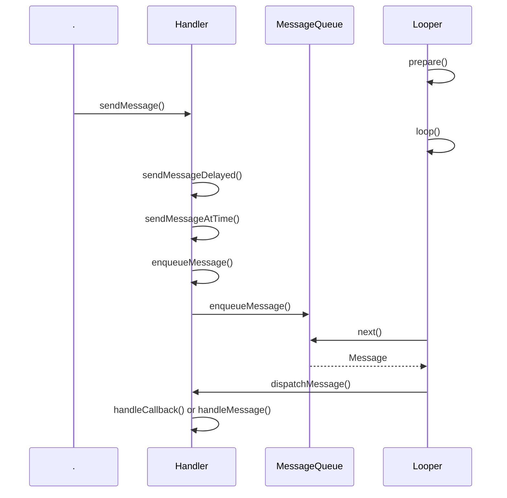

# Android

## Activity
### 生命周期


onRestart可以代替onResume做一些数据刷新的操作。

onStart和onStop：是否可见的角度。onStart代表即将可见，但是用户不能与之交互；onStop代表完全不可见

onPause和onResume：是否处于前台，用户可与之交互的角度。例如 A Activity 启动一个 windowIsFloating 或者 windowIsTranslucent 主题的 B Activity时，A只会回调 onPause，不会进入 onStop，因为此时 A Activity 还是部分可见的，但是用户不能与之交互。

先启动A: A.onCreate() -> A.onStart() -> A.onResume()

再从A中启动B: A.onPause() -> B.onCreate() -> B.onStart() -> B.onResume() -> A.onStop()

按返回键从B回到A：B.onPause() -> A.onRestart() -> A.onStart() -> A.onResume() -> B.onStop() -> B.onDestroy()

从 A 启动 B 时，首先 A onPause() ，此时用户无法与A交互了，然后 B 依次 onCreate() -> onStart()->onResume()，此时 B 可见且可以交互了，所以  A 完全不可见进入 onStop() 

onWindowFocusChanged()：Activity获取或失去焦点时的回调，例如在 Activity 中拉下系统状态面板，则 Activity 会失去焦点，再拉上去又回重新获取到焦点。可以在这个回调中获取View的宽高

onContentChanged()：setContentView()或者addContentView()方法执行导致Activity的View发生变化时回调

onPostCreate()/onPostResume(): onPostCreate() 在 onStart() 之后，onPostResume() 在 onResume() 之后。

[Android onSaveInstanceState()和onRestoreInstanceState()调用时机](https://blog.csdn.net/fenggering/article/details/53907654)

[Android 横竖屏切换](https://www.jianshu.com/p/dbc7e81aead2)：从Android 3.2开始，横竖屏切换时，screenSize也会发生变化，所以需要配置 "android:configChanges="orientation|screenSize"，Activity才不会重启，只会回调 onConfigurationChanged() 方法

监听 Home 按键：监听 "android.intent.action.CLOSE_SYSTEM_DIALOGS" 广播，获取 "reason" 字段携带的值，判断是 多任务案按键 还是 home 按键；

onUserLeaveHint() / onUserInteraction()：举例：按下 home 按键或者或者启动一个新的 Activity，则当前Activity会回调 onUserLeaveHint() 方法

为何调用 finish() 之后 onStop() /onDestroy() 会延迟10s执行：

当前 Activity 调用 finish() 之后，首先跨进程调用 AMS 的 finishActivity() 方法，AMS 通过 ApplicationThread.schedulePauseActivity() 再回调到 APP 进程，在 ActivityThread 里面调用当前 Activity 的 onPause()，然后又跨进程通知 AMS.activityPaused()，在 AMS 进程把当前 Activity 放到要销毁的集合里面，然后通过 ApplicationThread.scheduleResumeActivity() 回到 APP 进程通知下一个 Activity onResume()，在 ActivityThread .handleResumeActivity() 里面主线程addIdleHandler，等空闲状态时才会通知 AMS 去执行后续当前 Activity 的 onStop/onDestroy()，所以如果下一个 Activity 一直在主线程的 Looper 抛事件，则当前 Activity 的  onStop/onDestroy() 就一直得不到执行的机会。但是 AMS 有个超时机制，在通知下一个 Activity onResume() 之前，会抛出一个延时 IDLE_TIMEOUT（10s）的 IDLE_TIMEOUT_MSG 事件，如果一直等不到下一个 Activity 的 idel 空闲通知，则会强制去 stop/destroy() 当前 Activity。


### Intent

显式Intent

隐式Intent

为了确保应用的安全性，启动 `Service` 时，请始终使用显式 Intent，且不要为服务声明 Intent 过滤器

Intent Filter匹配规则

action：一个Intent Filter中可声明多个action，Intent中的action与其中的任一个action在字符串形式上完全相同（注意，区分大小写，大小写不同但字符串内容相同也会造成匹配失败），action方面就匹配成功。隐式Intent必须指定action（如不指定action则必须指定data或mimetype，这种情况下，只要IntentFilter至少含有一个action就可以匹配）。

category：Intent中个如果含有category，那么所有的category都必须和过滤规则中的其中一个category相同；Intent中也可以没有category（若Intent中未指定category，系统会自动为它带上“android.intent.category.DEFAULT”，所以，如果你的 activity支持接收隐式intent的话就一定要在intent filter中加入android.intent.category.DEFAULT

data：URI完全匹配
* <scheme>://<host>:<port>/<path>  
* mimeType

```java
<intent-filter>
    <action android:name="android.intent.action.MAIN" />

    <category android:name="android.intent.category.LAUNCHER" />
</intent-filter>
```
这二者共同出现，标明该Activity是一个入口Activity，并且会出现在系统应用列表中，二者缺一不可。

### 启动模式
[解开Android应用程序组件Activity的"singleTask"之谜](https://blog.csdn.net/Luoshengyang/article/details/6714543)
[Android中Activity四种启动模式和taskAffinity属性详解](https://blog.csdn.net/zhangjg_blog/article/details/10923643)
1、针对 launchmode 为 SingleTask 的 Activity，代表该 Activity 可以通过创建新 task 的方式启动，但是是否真的创建新的 task，还有其他条件的限制，例如：需要指定与启动该Activity task 不同的 taskAffinity、不是通过 startActivityForResult 启动该 Activity
2、在启动一个singleTask的Activity实例时，如果系统中已经存在这样一个实例，就会将这个实例调度到任务栈的栈顶，并清除它当前所在任务中位于它上面的所有的activity
3、以singleInstance模式启动的Activity在整个系统中是单例的，如果在启动这样的Activity时，已经存在了一个实例，那么会把它所在的任务调度到前台，重用这个实例。
4、以singleInstance模式启动的Activity具有独占性，即它会独自占用一个任务，被他开启的任何activity都会运行在其他任务中
[ACTIVITY 的属性ANDROID:TASKAFFINITY和ANDROID:ALLOWTASKREPARENTING](https://www.cnblogs.com/androidxiaoyang/archive/2013/05/13/3075676.html)

android:allowTaskReparenting：如果一个 Activity 没有指定为 SingleTask 或者设置了 FLAG_ACTIVITY_NEW_TASK，则没有创建新 task 的能力，所以只能在启动它的 task 里面（例如A应用启动了B应用的某个Activity），如果此时一个具有跟该 Activity 相同 taskAffinity 的 task 进入前台，该属性值指定为 true 时，该 Activity 就会重新转移到这个 task 里面去。

android:alwaysRetainTaskState：task长时间处于后台，重新进入的时候是否会保留 task 里面的所有activity，默认是 false，代表会清除根Activity之外其他所有的Activity。该属性只对 task 的根 Activity 起作用。

android:clearTaskOnLaunch：当task重新进入前台时，是否清除除根 Activity 之外的所有 Activity ，默认是false。该属性只对 task 的根 Activity 起作用。

android:finishOnTaskLaunch：当task重新进入前台时，是否关闭该Activity，优先级比 allowTaskReparenting 高。对 task 中的所有 Activity 有效。

Intent.FLAG_ACTIVITY_CLEAR_TOP：如果task中存在对应activity的实例，例如A->B->C（都是标准启动模式），此时在启动一个A，则首先B.onDestroyed()->C.onPause()->A.onDestroy()->A重新创建->C.onStop()->C.onDestory()

Intent.FLAG_ACTIVITY_NEW_TASK：当启动一个activity时如果具有此标记位，代表新启动的app是可以创建一个新的task的，当然不一定会启动新的task，具体参考上面的 Singletask 模式

Intent.FLAG_ACTIVITY_SINGLE_TOP：如果task中栈顶是该activity的实例，则不会创建新的activity，会依次调用该activity的 onPause()->onNewIntent()->onResume()

SingleTask模式 = Intent.FLAG_ACTIVITY_NEW_TASK（能创建新的task ）+ Intent.FLAG_ACTIVITY_CLEAR_TOP + Intent.FLAG_ACTIVITY_SINGLE_TOP （task栈内复用）

### Context


[面试官灵魂发问：你真的懂 Context 吗？](https://blog.csdn.net/weixin_44339238/article/details/106123300)

ContextWrapper是上下文功能的封装类，而ContextImpl则是上下文功能的实现类，ContextWrapper装饰ContextImpl。而ContextWrapper又有三个直接的子类， ContextThemeWrapper、Service和Application。其中，ContextThemeWrapper是一个带主题的封装类，而它有一个直接子类就是Activity，所以Activity和Service以及Application的Context是不一样的，只有Activity需要主题，Service不需要主题。

getApplication()只能在activity、service里面调用，getApplicationContext()只要有Context的实例就能调用到 ccontext.getApplicationContext(); getBaseContext获取ContextWrapper里面包装的ContextImpl对象

Context的数量 = Activity的数量+Service的数量+1（Application）

非Activity的Context做一些 Activity Context 的操作：

* 非Activity的Context（ContextWrapper）启动Activity需要必须增加 Intent.FLAG_ACTIVITY_NEW_TASK 的Flag，因为非Activity的Context调用startActivity默认是调用了ContextImpl 的startActivity方法，内部有判断 Intent 是否包含Intent.FLAG_ACTIVITY_NEW_TASK，没有则抛出AndroidRuntimeException

* 非Activity的Context inflate layout 会使用系统默认的主题样式

* 非Activity的Context不能 show 普通的dialog（应用窗口类型1-99），WMS会校验token，返回对应的错误码，APP进程收到之后抛出 WindowManager.BadTokenException

  AMS 在启动 Activity 的时候，会构建表示 Activity 信息的 ActivityRecord 对象，其构造函数中会实例化 Token 对象

  AMS 在接着上一步之后，会利用创建的 Token 构建 AppWindowContainerController 对象，最终将 Token 存储到 WMS 中的 mTokenMap 中

  WMS 在 addWindow 时，会根据当前 Window 对象的 Token 进行校验

  ```java
   if (type >= FIRST_APPLICATION_WINDOW && type <= LAST_APPLICATION_WINDOW) {
                      Slog.w(TAG_WM, "Attempted to add application window with unknown token "
                            + attrs.token + ".  Aborting.");
                      return WindowManagerGlobal.ADD_BAD_APP_TOKEN;
                  }
  ```

  非Activity的Context parentWindow 为空所以不会调用 adjustLayoutParamsForSubWindow，从而引发 BadTokenException

在 View 中对 context 强转出现 ClassCastException：android.view.ContextThemeWrapper cannot be cast to Activity

```java
Dialog(@NonNull Context context, @StyleRes int themeResId, boolean createContextThemeWrapper) {
        if (createContextThemeWrapper) {
            if (themeResId == 0) {
                final TypedValue outValue = new TypedValue();
                context.getTheme().resolveAttribute(R.attr.dialogTheme, outValue, true);
                themeResId = outValue.resourceId;
            }
            mContext = new ContextThemeWrapper(context, themeResId);
        } else {
            mContext = context;
        }
        ......
    }
```

Dialog中的 Context 会被重新包装为 ContextThemeWrapper，所以 Dialog 中的 View 通过 getContext() 获取到的都是 ContextThemeWrapper，可以通过 getBaseContext() 获取到 Activity 实例。

同理 ClassCastException：TintContextWrapper cannot be cast to Activity

```java
   public AppCompatTextView(Context context, AttributeSet attrs, int defStyleAttr) {
        super(TintContextWrapper.wrap(context), attrs, defStyleAttr);
        ......
    }
```

AppCompat 的 View 获取到的是 TintContextWrapper（getResource() 具有对资源着色的能力）


## Fragment
### 生命周期


### 概述
Fragment：理解为针对 View 的一个封装框架

### 管理与事务

FragmentManager：Fragment管理抽象类，定义了可以对外暴露的Fragment出栈、查找栈中添加的Fragment、获得事务对象等方法；FragmentManagerImpl是FragmentManager的实现类。getChildFragmetManager、getFragmentManager、getSupportFragmentManager

FragmentTransaction：定义了对Fragment的事务操作，add、remove、hide、show等方法，以及commit、commitAllowingStateLoss（异步，通过Activity的handler抛事件）、commitNow、commitNowAllowingStateLoss（同步，不允许添加进fragment栈，不然会影响其他异步的事务），具体实现类为 BackStackRecord，里面用链表维护保存事务的所有操作（Op）

[Fragment操作方法和生命周期的关系](https://blog.csdn.net/goodlixueyong/article/details/50257079)

[Android高频面试专题 - 基础篇（二）Fragment](https://cloud.tencent.com/developer/article/1601351)

### 懒加载

[Androidx 下 Fragment 懒加载的新实现](https://juejin.im/post/6844904050698223624)

老的懒加载实现：如果是 FragmentManager add、show/hide 的形式，则借助 Fragment 的 onHiddenChanged 方法来实现只有当前显示的 Fragment 才加载数据；如果是 Viewpager+FragmentPagerAdapter 的形式，则借助 Fragment 的 setUserVisibleHint 方法来实现；

AndroidX：setUserVisibleHint被标记为过时了，Viewpager+FragmentPagerAdapter 的形式可以使用 FragmentTransaction 的 setMaxLifecycle 来实现懒加载，构造 FragmentPagerAdapter 的时候传 behavior 为 BEHAVIOR_RESUME_ONLY_CURRENT_FRAGMENT，则内部会通过 setMaxLifecycle 来自动处理，确保只有显示的 Fragment 才回调 onResume 方法

FragmentPagerAdapter更多的用于相对静态的、少量界面的ViewPager，划过的fragment会保存在内存中，如果加载的fragment较多会占用大量的内存，处于当前显示的 Fragment 前后 limit （通过 setOffscreenPageLimit() 设置）个以外的 Fragment 只会调用 onDestroyView，并不会onDestroy、onDetach。而FragmentStatePagerAdapter适用于数据动态性较大、页面比较多的情况，它并不会保存所有的fragment，只会保存当前显示的Fragment以及其前后 limit 个，其他会被销毁掉onDestroy、onDetach。


## Handler

### 基本原理

Handler机制基本原理图：


线程使用 Handler 之前首先要创建该线程的 Looper 实例，然后调用 `Looper.loop()` 来开启消息循环。外部通过 Hander 实例来发送 Message，根据发送的时间排序插入到 MessageQueue（链表） 中，其中 Looper 不断循环地从 MessageQueue 中获取 Message，最后通过 Message 的 `target` 变量（即发送该 Message 的 Handler 实例） 的 `dispatchMessage` 方法回调给外部处理（`handleCallback` 或者 `handleMessage`）。




Message 对象需要通过 `obtain` 方法来获得（你要自己 new 也没办法），因为其内部维护了一个以单链表形式保存的对象池，能够重复利用 Message  对象，避免频繁的创建和回收，提升程序性能。Message 对象池最多能存 50 个对象，并且关键性操作都加了锁，是线程安全的。

每个线程有且只有一个 Looper 对象，内部通过 ThreadLocal 来保存，使用 Handler 之前必须先通过 `Looper.prepare` 创建 Looper 对象

Looper.java：

```java
// sThreadLocal.get() will return null unless you've called prepare().
static final ThreadLocal<Looper> sThreadLocal = new ThreadLocal<Looper>();
private static Looper sMainLooper;  // guarded by Looper.class

......
  
public static void prepare() {
      prepare(true);
}

private static void prepare(boolean quitAllowed) {
        if (sThreadLocal.get() != null) {
            throw new RuntimeException("Only one Looper may be created per thread");
        }
        sThreadLocal.set(new Looper(quitAllowed));
}

/**
     * Initialize the current thread as a looper, marking it as an
     * application's main looper. The main looper for your application
     * is created by the Android environment, so you should never need
     * to call this function yourself.  See also: {@link #prepare()}
     */
public static void prepareMainLooper() {
       //UI主线程不允许quit
       prepare(false);
       synchronized (Looper.class) {
            if (sMainLooper != null) {
                throw new IllegalStateException("The main Looper has already been prepared.");
            }
            sMainLooper = myLooper();
        }
}

/**
 * Returns the application's main looper, which lives in the main thread of the application.
 */
public static Looper getMainLooper() {
       synchronized (Looper.class) {
           return sMainLooper;
       }
}

......
  
/**
 * Return the Looper object associated with the current thread.  Returns
 * null if the calling thread is not associated with a Looper.
 */
public static @Nullable Looper myLooper() {
     return sThreadLocal.get();
}
```

Handler,java：

```java
public Handler(Callback callback, boolean async) {
        if (FIND_POTENTIAL_LEAKS) {
            //内部有检查Handler是否为内部静态类，警告内存泄漏，Google自己用的......吧！！
            final Class<? extends Handler> klass = getClass();
            if ((klass.isAnonymousClass() || klass.isMemberClass() || klass.isLocalClass()) &&
                    (klass.getModifiers() & Modifier.STATIC) == 0) {
                Log.w(TAG, "The following Handler class should be static or leaks might occur: " +
                    klass.getCanonicalName());
            }
        }

        mLooper = Looper.myLooper();
        if (mLooper == null) {
            //创建 Handler 对象时判断 Looper 是否准备好了 
            throw new RuntimeException(
                "Can't create handler inside thread that has not called Looper.prepare()");
        }
        mQueue = mLooper.mQueue;
        mCallback = callback;
        mAsynchronous = async;
    }
```


### 不常用

postSyncBarrier、removeSyncBarrier、setAsynchronous

[Android消息机制之同步障碍机制和应用](https://blog.csdn.net/yanzhenjie1003/article/details/96497153)

`postSyncBarrier` 会在指定的时间戳插入一条没有 target 的 Message，作为一个同步消息队列循环的屏障，当 Looper 轮询到该 Message 的时候，会优先把后续设置了 `setAsynchronous(true)` 的所有异步消息找出来执行。如果没有异步消息的话，Looper 的线程会通过调用 `nativePollOnce` 进入无限等待，直到 `enqueueMessage`新的消息或调用 removeSyncBarrier 移除掉这个同步屏障时，回调用 `nativeWake` 唤醒线程。`ViewRootImpl.scheduleTraversals()` 时用到了 `postSyncBarrier`。

nativePollOnce、nativeWake

当 MessageQueue 中没有可用的消息时，会通过 nativePollOnce 使线程进入阻塞状态，释放 CPU 资源，nativePollOnce 底层是通过 linux pipe（？？？eventfd？？Android M）/epoll 机制实现的，对某个文件描述符调用 epoll_wait，线程就会阻塞在管道的读端；当有新消息或者其他需要唤醒情况时，会通过 nativeWake 唤醒当前线程，nativeWake 底层通过往管道写端写入一个字节数据，从而唤醒线程从管道读端返回。nativePollOnce 大致等同于 Object.wait(), nativeWake 等同于 Object.notify(),只不过它们的实现完全不同: nativePollOnce使用 epoll, 而 Object.wait 使用 futex Linux 调用.

IdelHandler应用

```java
//添加时有加锁，是线程安全的
handler.getLooper().getQueue().addIdleHandler(IdleHandler handler)
```

当 MessageQueue 最近没有消息需要处理的时候，如果此时添加了 IdleHandler，则会去执行 IdleHandler 的 `queueIdle()` 方法，这个方法适合做一些需要在主线程空闲下来时对业务来说不太重要的事情。`queueIdle()` 返回 false 在本次空闲时执行后就会被自动 remove 掉，返回 true 代表本次空闲时执行后不 remove 掉。`MessageQueue.next()` 会遍历当前 Message 链表查找下一个需要处理的消息，如果始终没有消息的话，IdleHandler 是否会一直执行从而死循环？不会，因为只有在第一次循环的时候才会去处理 IdleHandler，后续除非有需要处理的消息了跳出此次循环，等再次进入循环遍历的时候才会继续又处理一次 IdleHandler。

```java
Message next() {
        ......
        int pendingIdleHandlerCount = -1; // -1 only during first iteration
        int nextPollTimeoutMillis = 0;
        for (;;) {
            ......
            nativePollOnce(ptr, nextPollTimeoutMillis);

            synchronized (this) {
                ......
                //省略，如果遍历到了可处理的消息，则会直接return跳出循环

                //pendingIdleHandlerCount<0才会进入此循环，所以只会在第一次循环的时候进入
                if (pendingIdleHandlerCount < 0
                        && (mMessages == null || now < mMessages.when)) {
                    pendingIdleHandlerCount = mIdleHandlers.size();
                }
                if (pendingIdleHandlerCount <= 0) {
                    // No idle handlers to run.  Loop and wait some more.
                    mBlocked = true;
                    continue;
                }

                if (mPendingIdleHandlers == null) {
                    mPendingIdleHandlers = new IdleHandler[Math.max(pendingIdleHandlerCount, 4)];
                }
                mPendingIdleHandlers = mIdleHandlers.toArray(mPendingIdleHandlers);
            }

            // Run the idle handlers.
            // We only ever reach this code block during the first iteration.
            for (int i = 0; i < pendingIdleHandlerCount; i++) {
                final IdleHandler idler = mPendingIdleHandlers[i];
                mPendingIdleHandlers[i] = null; // release the reference to the handler

                boolean keep = false;
                try {
                    keep = idler.queueIdle();
                } catch (Throwable t) {
                    Log.wtf(TAG, "IdleHandler threw exception", t);
                }

                if (!keep) {
                    synchronized (this) {
                        mIdleHandlers.remove(idler);
                    }
                }
            }

            //这个值置0，所以如果一直没有可处理的消息的话，IdleHandler不会重复执行，除非有新的消息处理跳出了本次循环
            pendingIdleHandlerCount = 0;
            ......
        }
    }
```


### 常见问题

[Android中为什么主线程不会因为Looper.loop()里的死循环卡死？](https://www.zhihu.com/question/34652589)

1. `Looper.loop` 开启消息循环处理，是保证主线程不退出的原因，其它 binder 线程（例如 ApplicationThread binder 对象）通过 Hander 往里面发送消息，所以主线程能够依次处理这些消息，保证 Android 生命周期有条不紊地进行。
2. 当消息循环没有可用的消息时，会借助 linux 的 pipe/epoll 机制使主线程进入阻塞状态，让出 CPU 资源，当重新有可用的新消息时，又会重新唤醒主线程。

[Android只在UI主线程修改UI，是个谎言吗？ 为什么这段代码能完美运行](https://www.zhihu.com/question/24764972)

`ActivityThread.handleResumeActivity` 之后，会通过 WindowManager 添加当前 Activity 的顶级 DecorView，此时会生成与之对应的 ViewRootImpl 实例，并通过 ViewRootImpl  来进行控制 View 树的测量布局与绘制。ViewRootImpl 在对 View进行操作前，会通过 `checkThread`方法来判断创建该 ViewRootImpl 实例的线程与操作该 ViewRootImpl 实例的线程是否一致，不一致则抛出 `CalledFromWrongThreadException` 异常。在 Activity 的 onCreate() 方法中，此时还没有创建 ViewRootImpl 实例，View也没有回调 `dispatchAttachedToWindow` 方法，所以它的 `mAttachInfo` `mParent` 变量都为空，此时 `invalidateInternal()` 方法中判断它们 null 时，就不会去调用 ViewRootImpl  实例的`invalidateChild()`方法，所以在 Activity 的 onCreate() 方法中开个即时线程去更新 UI 是不会报错的。

```java
void invalidateInternal(int l, int t, int r, int b, boolean invalidateCache,
            boolean fullInvalidate) {
        ......
        if ((mPrivateFlags & (PFLAG_DRAWN | PFLAG_HAS_BOUNDS)) == (PFLAG_DRAWN | PFLAG_HAS_BOUNDS)
                || (invalidateCache && (mPrivateFlags & PFLAG_DRAWING_CACHE_VALID) == PFLAG_DRAWING_CACHE_VALID)
                || (mPrivateFlags & PFLAG_INVALIDATED) != PFLAG_INVALIDATED
                || (fullInvalidate && isOpaque() != mLastIsOpaque)) {
            ......
            // Propagate the damage rectangle to the parent view.
            final AttachInfo ai = mAttachInfo;
            final ViewParent p = mParent;
            //检查 mAttachInfo、mParent（通过View层级往上最终会到ViewRootImpl）是否为null
            if (p != null && ai != null && l < r && t < b) {
                final Rect damage = ai.mTmpInvalRect;
                damage.set(l, t, r, b);
                p.invalidateChild(this, damage);
            }
            .......
        }
    }
```


从上可知，如果我在子线程中通过 WindowManager 添加 View 时，就需要在这个子线程中去更新UI，并不是一定要在主线程更新UI，而是要在创建该ViewRootImpl 的线程中去更新它。Android约定需要在主线程中更新UI，主要是因为UI绘制需要高效进行，如果设计为可以在多线程在环境下更新UI，则必定要做很多同步机制，这会大大影响绘制效率，且会出现各种问题。

HandlerThread

HandlerThread 继承自 Thread，在 `run` 方法里面帮我们做了 `Looper.prepare()`、`Looper.loop()`

### 问题
1.子线程一定不能更新UI吗？(校招&实习)
2.给我说说Handler的原理(校招&实习)
3.Handler导致的内存泄露你是如何解决的？
4.如何使用Handler让子线程和子线程通信？
5.你能给我说说Handler的设计原理？
6.HandlerThread是什么 & 原理 & 使用场景？
7.IdleHandler是什么？
8.一个线程能否创建多个Handler,Handler和Looper之间的对应关系？
9.为什么Android系统不建议子线程访问UI？
10.Looper死循环为什么不会导致应用卡死？
11.使用Handler的postDealy后消息队列有什么变化？
12.可以在子线程直接new一个Handler出来吗？
13.Message对象创建的方式有哪些 & 区别？
14.ANR和Handler存在什么联系吗？
15.子线程的Looper和主线程的Looper有什么区别？
16.说说Handler为什么不能进行跨进程通信？[为什么Android的Handler采用管道而不使用Binder？](https://www.zhihu.com/question/44329366)
17.Handler的消息延时是如何实现的？
18.什么是消息屏障？
19.假设主线程new了Handler A和Handler B以及Handler C,现在有个子线程，在子线程中通过Handler C发送了一条消息，那么Handler A和Handler B能接收到吗？为什么？


## View

###EditText

android:imeOptions 属性


###自定义View

#### Paint

[绘制文本drawText()](https://hencoder.com/ui-1-3/)

```kotlin
fun Canvas.drawTextByPoint(
    text: String,
    x: Float,
    y: Float,
    paint: Paint,
    align: Paint.Align = Paint.Align.CENTER
) {
    val fontMetrics = paint.fontMetrics
    val textWidth = paint.measureText(text)
    //基于y使文本居中计算绘制的baseline
    val baseLine = y - (fontMetrics.top + fontMetrics.bottom) / 2
    val drawX = when (align) {
        Paint.Align.LEFT -> x
        Paint.Align.CENTER -> x - textWidth / 2
        Paint.Align.RIGHT -> x - textWidth
    }
    drawText(text, drawX, baseLine, paint)
}
```


## Drawable


## 动画

### 帧动画

XML中使用 `animation-list` 定义，对应于 Java 的类是 `AnimationDrawable`，动画的原理是根据 `animation-list ` 定义的每一帧的图片（drawable）以及持续时间（duration），通过 Choreographer 请求 Vsync 信号，然后触发 View 的重绘。

`AnimationDrawable.start()`

```java
public void start() {
   mAnimating = true;
   if (!isRunning()) {
       //从第0帧开始显示
       setFrame(0, false, mAnimationState.getChildCount() > 1
                    || !mAnimationState.mOneShot);
   }
}
```

`AnimationDrawable.setFrame()`

```java
private void setFrame(int frame, boolean unschedule, boolean animate) {
        if (frame >= mAnimationState.getChildCount()) {
            return;
        }
        mAnimating = animate;
        mCurFrame = frame;
        selectDrawable(frame);
        if (unschedule || animate) {
            unscheduleSelf(this);
        }
        if (animate) {
            // Unscheduling may have clobbered these values; restore them
            //记录当前帧序列
            mCurFrame = frame;
            mRunning = true;
            scheduleSelf(this, SystemClock.uptimeMillis() + mAnimationState.mDurations[frame]);
        }
    }
```

`DrawableContainer.selectDrawable`

```java
public boolean selectDrawable(int index) {
        ......
        //触发View重绘
        invalidateSelf();
        return true;
    }
```

`Drawable.invalidateSelf()`

```java
public void invalidateSelf() {
        final Callback callback = getCallback();
        if (callback != null) {
            //此callbak即View对象，回调到View的invalidateDrawable()方法里面去，最终会触发View的invalidate()方法
            callback.invalidateDrawable(this);
        }
    }
```

上一帧重绘之后，根据绘制帧设置的持续时间（duration），去计划请求下一次Vsync信号，`Drawable.scheduleSelf()`

```java
public void scheduleSelf(@NonNull Runnable what, long when) {
        final Callback callback = getCallback();
        if (callback != null) {
            //此callbak即View对象，回调到View的scheduleDrawable()方法里面去
            callback.scheduleDrawable(this, what, when);
        }
    }
```

`View.scheduleDrawable()`

```java
public void scheduleDrawable(@NonNull Drawable who, @NonNull Runnable what, long when) {
        if (verifyDrawable(who) && what != null) {
            //请求Vsync操作的delay时间
            final long delay = when - SystemClock.uptimeMillis();
            if (mAttachInfo != null) {
                //通过Choreographer请求Vsync回调
                mAttachInfo.mViewRootImpl.mChoreographer.postCallbackDelayed(
                        Choreographer.CALLBACK_ANIMATION, what, who,
                        Choreographer.subtractFrameDelay(delay));
            } else {
                // Postpone the runnable until we know
                // on which thread it needs to run.
                getRunQueue().postDelayed(what, delay);
            }
        }
    }
```

Vsync信号回调回来，走到 `AnimationDrawable.run()`

```java
@Override
    public void run() {
        nextFrame(false);
    }
```

`AnimationDrawable.nextFrame()`

```java
private void nextFrame(boolean unschedule) {
        int nextFrame = mCurFrame + 1;
        final int numFrames = mAnimationState.getChildCount();
        final boolean isLastFrame = mAnimationState.mOneShot && nextFrame >= (numFrames - 1);

        //如果XML里面设置oneshot为false，则循环播放动画
        if (!mAnimationState.mOneShot && nextFrame >= numFrames) {
            nextFrame = 0;
        }
        //继续显示下一帧，形成闭环
        setFrame(nextFrame, unschedule, !isLastFrame);
    }
```


## 屏幕适配

### 屏幕基础知识

**屏幕尺寸**：指手机屏幕对角线的长度，单位为英寸：inch，1inch = 2.54cm

**像素点**：手机屏幕的最小构成单元（Pixel）

**分辨率**：手机屏幕（横屏）宽度像素点数x高度像素点数，例如 1280x720（720P）1920x1080（1080P），其中720、1080代表纵向（高度）有多少行像素，P代表逐行扫描，2560x1440（2K）、3840x2160（4K），代表横向（宽度）大于 2000、4000 列像素；720i、1080i，i代表隔行扫描。[1080p」和「2k、4k」的关系与差别在哪里](https://www.zhihu.com/question/24205632)

**像素密度**：对于 Android 来说，即 PPI（Pixels Per Inch，每 inch 占的像素点数）或者 DPI（Dots Per Inch，这个实际上是用于打印机的，代表每 inch 墨点数）。例如小米，屏幕分辨率为3200x1440，尺寸为6.81 inch，则其像素密度 PPI（DPI） 为：
$$
\sqrt(3200^2+1440^2)\div6.81 = 515
$$

**PX**：即 Pixel，像素单位，屏幕分辨率使用的单位也就是 PX

**PT**：标准的长度单位，1pt＝1/72 inch

**DP**：即 DIP，Density-independent Pixels，密度无关像素单位。规定分辨率 320×480，尺寸 3.6 inch 的屏幕像素密度（160dpi）定义为标准像素密度，此时 1DP = 1PX，所以 DP 跟 PX 的换算关系为：
$$
PX = DP*\frac{DPI}{160}
$$

**SP**：scaled pixels，跟 DP 类似，但是会根据系统设置的字体大小偏好进行缩放


adb查看屏幕参数信息：

```bash
➜  ~ adb shell dumpsys window displays | head -n 3
WINDOW MANAGER DISPLAY CONTENTS (dumpsys window displays)
  Display: mDisplayId=0
    init=1080x1920 400dpi cur=1920x1080 app=1920x1080 rng=1080x1020-1920x1860
    
➜  ~ adb shell wm size
Physical size: 1080x1920

➜  ~ adb shell wm density                            
Physical density: 400
```

代码中获取屏幕信息：

```kotlin
  val metrics = resources.displayMetrics
  Log.d(TAG, "metrics.widthPixels=${metrics.widthPixels}")
  Log.d(TAG, "metrics.heightPixels=${metrics.heightPixels}")
  //DPI的一个比例因子，120DPI：0.75f，160DPI：1.0f，240DPI：1.5f
  Log.d(TAG, "metrics.density=${metrics.density}")
  Log.d(TAG, "metrics.densityDpi=${metrics.densityDpi}")
  Log.d(TAG, "metrics.scaledDensity=${metrics.scaledDensity}")
  Log.d(TAG, "metrics.xdpi=${metrics.xdpi}")
  Log.d(TAG, "metrics.ydpi=${metrics.ydpi}")
```

```bash
2021-02-23 21:34:45.709 10402-10402/? D/MainActivity: metrics.widthPixels=1920
2021-02-23 21:34:45.709 10402-10402/? D/MainActivity: metrics.heightPixels=1080
2021-02-23 21:34:45.709 10402-10402/? D/MainActivity: metrics.density=2.5
2021-02-23 21:34:45.709 10402-10402/? D/MainActivity: metrics.densityDpi=400
2021-02-23 21:34:45.709 10402-10402/? D/MainActivity: metrics.scaledDensity=2.5
2021-02-23 21:34:45.709 10402-10402/? D/MainActivity: metrics.xdpi=320.0
2021-02-23 21:34:45.709 10402-10402/? D/MainActivity: metrics.ydpi=320.0
```


| 密度限定符 | 说明                                                         |
| :--------- | :----------------------------------------------------------- |
| `ldpi`     | 适用于低密度 (ldpi) 屏幕 (~ 120dpi) 的资源。                 |
| `mdpi`     | 适用于中密度 (mdpi) 屏幕 (~ 160dpi) 的资源（这是基准密度）。 |
| `hdpi`     | 适用于高密度 (hdpi) 屏幕 (~ 240dpi) 的资源。                 |
| `xhdpi`    | 适用于加高 (xhdpi) 密度屏幕 (~ 320dpi) 的资源。              |
| `xxhdpi`   | 适用于超超高密度 (xxhdpi) 屏幕 (~ 480dpi) 的资源。           |
| `xxxhdpi`  | 适用于超超超高密度 (xxxhdpi) 屏幕 (~ 640dpi) 的资源。        |
| `nodpi`    | 适用于所有密度的资源。这些是与密度无关的资源。无论当前屏幕的密度是多少，系统都不会缩放以此限定符标记的资源。 |
| `tvdpi`    | 适用于密度介于 mdpi 和 hdpi 之间的屏幕（约 213dpi）的资源。这不属于“主要”密度组。它主要用于电视，而大多数应用都不需要它。对于大多数应用而言，提供 mdpi 和 hdpi 资源便已足够，系统将视情况对其进行缩放。如果您发现有必要提供 tvdpi 资源，应按一个系数来确定其大小，即 1.33*mdpi。例如，如果某张图片在 mdpi 屏幕上的大小为 100px x 100px，那么它在 tvdpi 屏幕上的大小应该为 133px x 133px。 |


## Bitmap

位图，储存像素信息的数据结构（通过某种方式用Bit来映射色值），通过它可以得到一系列的图像属性，还可以对图像进行旋转，切割，放大，缩小等操作。

### 创建Bitmap

需要通过 BitmapFactory 来创建 Bitmap

```kotlin
BitmapFactory.decodeByteArray()
BitmapFactory.decodeFile()
BitmapFactory.decodeResource()
BitmapFactory.decodeResourceStream()
BitmapFactory.decodeStream()
```

`decodeFile` `decodeResource` `decodeResourceStream` 最终会都调用 `decodeStream`，`decodeResource` 在解析时会根据资源文件夹（inDensity）以及设备本身（inTargetDensity）的屏幕像素密度来做合适的缩放。

### BitmapFactory.Options

创建 Bitmap 时可以穿入 Options 对象配置参数：

#### inScale、inDensity、inTargetDensity：

如果`inScaled` 指定为 true 或者不指定（Options 构造函数默认置 true），则 decode 的时候会根据 `inDensity`、`inTargetDensity` 来进行缩放：

`BitmapFactory.cpp doDecode()`

```c++
static jobject doDecode(JNIEnv* env, SkStreamRewindable* stream, jobject padding, jobject options) {
    ......
    if (options != NULL) {
        sampleSize = env->GetIntField(options, gOptions_sampleSizeFieldID);
        // Correct a non-positive sampleSize.  sampleSize defaults to zero within the
        // options object, which is strange.
        if (sampleSize <= 0) {
            sampleSize = 1;
        }
        ...
        //inScaled为true
        if (env->GetBooleanField(options, gOptions_scaledFieldID)) {
            const int density = env->GetIntField(options, gOptions_densityFieldID);
            const int targetDensity = env->GetIntField(options, gOptions_targetDensityFieldID);
            const int screenDensity = env->GetIntField(options, gOptions_screenDensityFieldID);
            if (density != 0 && targetDensity != 0 && density != screenDensity) {
                //根据inDensity、inTargetDensity 计算缩放比例 
                scale = (float) targetDensity / density;
            }
        }
    }
    ...
    int scaledWidth = size.width();
    int scaledHeight = size.height();
    bool willScale = false;

    // Apply a fine scaling step if necessary.
    if (needsFineScale(codec->getInfo().dimensions(), size, sampleSize)) {
        willScale = true;
        scaledWidth = codec->getInfo().width() / sampleSize;
        scaledHeight = codec->getInfo().height() / sampleSize;
    }
    ...
    // Scale is necessary due to density differences.
    if (scale != 1.0f) {
        willScale = true;
        //根据缩放比例计算bitmap实际decode的宽高
        scaledWidth = static_cast<int>(scaledWidth * scale + 0.5f);
        scaledHeight = static_cast<int>(scaledHeight * scale + 0.5f);
    }
    ...
    return GraphicsJNI::createBitmap(env, javaAllocator.getStorageObjAndReset(),
            bitmapCreateFlags, ninePatchChunk, ninePatchInsets, -1);
}
```

#### inJustDecodeBounds、inSampleSize

inJustDecodeBounds 指定为 true 时，不会真正 decode ，不会分配像素内存数据，可以用于在创建 bitmap 之前获取图片的原始宽高跟 mime 类型：

```kotlin
val options = BitmapFactory.Options()
options.inJustDecodeBounds = true
val bitmap = BitmapFactory.decodeResource(resources, R.drawable.big_sower, options)

Log.d(TAG, "bitmap=$bitmap")
Log.d(TAG, "options.outWidth=${options.outWidth}")
Log.d(TAG, "options.outHeight=${options.outHeight}")
Log.d(TAG, "options.outMimeType=${options.outMimeType}")
```

```bash
2021-02-24 11:02:12.197 1980-1980/? D/MainActivity: bitmap=null
2021-02-24 11:02:12.197 1980-1980/? D/MainActivity: options.outWidth=276
2021-02-24 11:02:12.197 1980-1980/? D/MainActivity: options.outHeight=214
2021-02-24 11:02:12.197 1980-1980/? D/MainActivity: options.outMimeType=image/png
```

inSampleSize 设置采样率，缩小原始图片大小。例如在 drawable-mdpi（160DPI） 放置了一张图片，原始分辨率为 276*214，在 400 DPI 的设备上加载，并设置采样率 inSampleSize = 2，看创建出来的 Bitmap 有多大？根据上面的分析，最终创建出来的位图宽应该为：
$$
outWidth = originalWidth\div{inSampleSize}*\frac{inTargetDensity}{inDensity}
$$
即 `276/2*(400/160) = 345`，通过代码验证一致：

```kotlin
options.inJustDecodeBounds = false
options.inSampleSize = 2
val scaleBitmap = BitmapFactory.decodeResource(resources, R.drawable.big_sower, options)
Log.d(TAG, "scaleBitmap.width=${scaleBitmap.width}")
Log.d(TAG, "scaleBitmap.height=${scaleBitmap.height}")
```

```bash
2021-02-24 12:00:21.555 3671-3671/? D/MainActivity: scaleBitmap.width=345
2021-02-24 12:00:21.555 3671-3671/? D/MainActivity: scaleBitmap.height=268
```

#### inpreferredConfig

指定图片解码时**首选（非强制[Android inpreferredconfig参数分析](https://blog.csdn.net/ccpat/article/details/46834089)）**的颜色模式配置，默认为 `Bitmap.Config.ARGB_8888`

| Bitmap.Config | 说明                                                         |      |
| :------------ | :----------------------------------------------------------- | ---- |
| ALPHA_8       | 每个 pixel 占 8 位，存储的是图片的透明值，占 1 个字节        |      |
| RGB_565       | 每个 pixel 占 16 位，分别为 5-R、6-G、5-B 通道，没有 ALPHA 通道，占 2 个字节 |      |
| ARGB_4444     | 每个 pixel 占 16 位，即每个通道用 4 位表示，占 2 个字节（质量太差，过时了） |      |
| ARGB_8888     | 每个 pixel 占 32 位，每个通道用 8 位表示,占 4 个字节         |      |

#### InBitmap、inMutable

使用 InBitmap 能够复用 Bitmap 内存块（必须是 Mutable 的），避免大块内存的重新分配与回收。

[Android Bitmap inBitmap 图片复用？](https://www.zhihu.com/question/32232584)

#### inPremultiplied

ALPHA通道预乘，默认为true。View系统跟 Canvas 默认绘制的图像都会通过预乘处理，所以不能设置为false，否则会抛出异常。

### Bitmap占多大内存

[Android 开发绕不过的坑：你的 Bitmap 究竟占多大内存？](https://cloud.tencent.com/developer/article/1071001)

用上面 inSampleSize 的例子，drawable-mdpi（160DPI） 放置一张原始分辨率为 276*214，在 400 DPI 的设备上加载，占用多大内存？

首先按照上面的知识计算 decode 出来的 Bitmap 有多大：

```bash
width: 276*(400/160) = 690
height: 214*(400/160) = 535
```

由于 inpreferredConfig 默认为 `Bitmap.Config.ARGB_8888`，所以一个像素点占4个字节，即最终创建出来的 bitmap 大小为：

```bash
690*535*4 = 1476600
```

同样可以通过代码验证一致：

```kotlin
val bitmap = BitmapFactory.decodeResource(resources, R.drawable.big_sower)
Log.d(TAG, "bitmap.width=${bitmap.width}")
Log.d(TAG, "bitmap.height=${bitmap.height}")
Log.d(TAG, "bitmap.rowBytes=${bitmap.rowBytes}")
Log.d(TAG, "bitmap.byteCount=${bitmap.byteCount}")
Log.d(TAG, "bitmap.allocationByteCount=${bitmap.allocationByteCount}")
```

```bash
2021-02-25 10:10:39.134 2282-2282/cn.thismj.android.demo D/MainActivity: bitmap.width=690
2021-02-25 10:10:39.134 2282-2282/cn.thismj.android.demo D/MainActivity: bitmap.height=535
2021-02-25 10:10:39.134 2282-2282/cn.thismj.android.demo D/MainActivity: bitmap.rowBytes=2760
2021-02-25 10:10:39.134 2282-2282/cn.thismj.android.demo D/MainActivity: bitmap.byteCount=1476600
2021-02-25 10:10:39.134 2282-2282/cn.thismj.android.demo D/MainActivity: bitmap.allocationByteCount=1476600
```

### Bitmap.recycle()

[Android Bitmap变迁与原理解析（4.x-8.x）](https://www.jianshu.com/p/d5714e8987f3)

[Android | Bitmap的Java对象GC之后，对应的native内存会回收吗？](https://www.jianshu.com/p/6f042f9e47a8)

2.3.3 版本之前，bitmap的像素数据储存在 native 里面，回收不可控，需要用户手动调用 `recycle()` 

* Java 层的 Bitmap 对象是一个壳, 非常小, 因此有可能会出现 Native 堆快到了 3G, Java 堆才 10 MB, 10MB 是无法触发 Dalvik GC 的, 因此这个 java 对象的 finalize 并非那么容易调用, 因此可能会出现 Native 堆 OOM 的情况, 故需要我们手动 recycle

3.0~7.1 版本之间，bitmap的像素数据储存在 Dalvik 碓中，可以通过 GC 自动回收，无须手动调用 `recycle()` 

* 像素数据直接放置到 Java 堆, Java 堆就能直接统计到真正的内存数据, 能够根据内存使用情况准确触发 GC 回收数据，隐患便是 Java 堆内存空间比较小, 容器造成 Java 堆的 OOM

- 4.4可以通过inInputShareable、inPurgeable让Bitmap的内存在native层分配（fresco、已废弃）

8.0 开始，bitmap的像素数据又回到了 native 里面了，但是内存管理更优秀，不需要用户手动去回收了

* `NativeAllocationRegistry`利用虚引用感知`Java`对象被回收的时机，来回收`native`内存

### Bitmap缓存管理

**LruCache**：LRU(Least Recently Used,最近最少使用)算法，采用 LinkedHashMap 内存缓存，accessOrder 指定为 true，遍历基于访问顺序 

[Android缓存机制-LRU cache原理与用法](https://juejin.cn/post/6844903678474715143)

**DisLruCache**：磁盘缓存的 LruCache

### 加载巨图如何防止OOM

BitmapRegionDecoder，从巨图中 decode 局部 bitmap，切片合并。

[https://github.com/LuckyJayce/LargeImage](https://github.com/LuckyJayce/LargeImage)


### 易出错的地方

LayoutInflater inflate 时如果 parent 传了 ull，则根布局设置的 layout params 无效，所以在布局里面设置了 layout_width 也无济于事了。

[[View not attached to window manager crash](https://stackoverflow.com/questions/22924825/view-not-attached-to-window-manager-crash)

[Android Studio Logcat 打印不全](https://stackoverflow.com/questions/8888654/android-set-max-length-of-logcat-messages)


