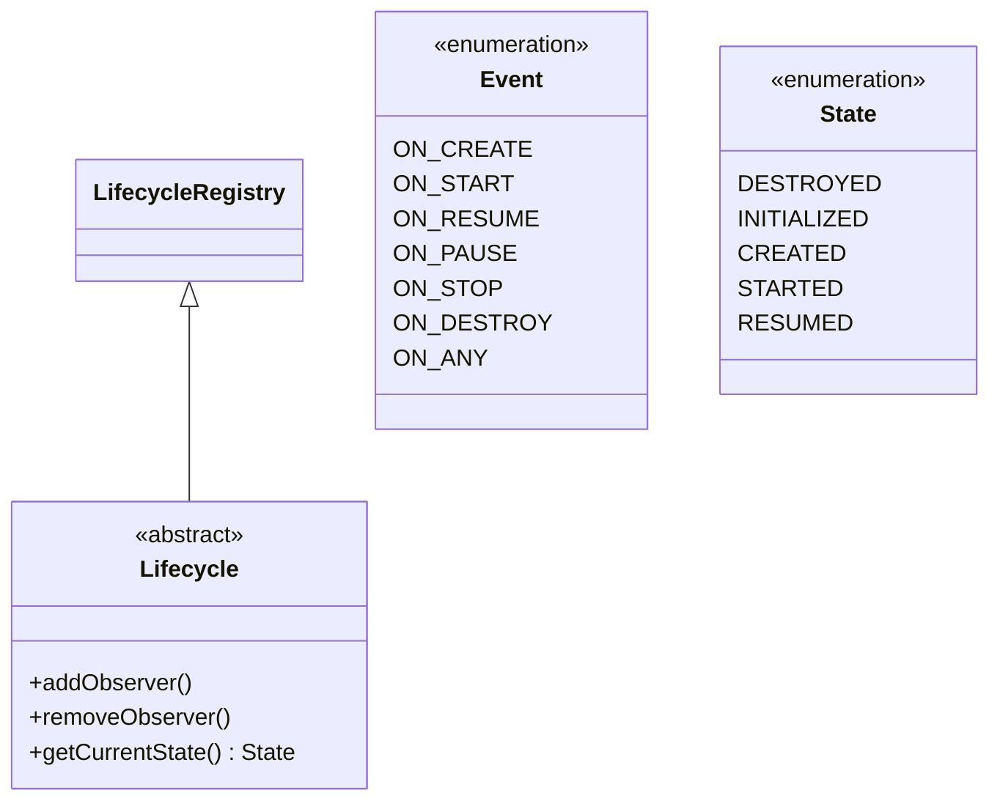
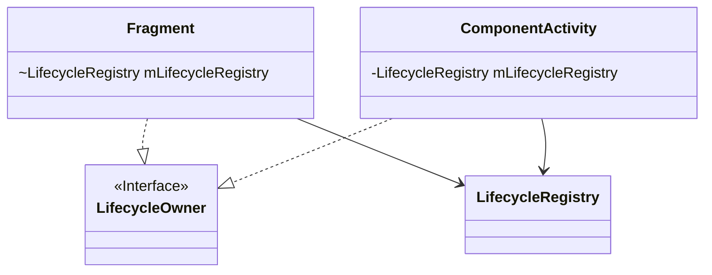
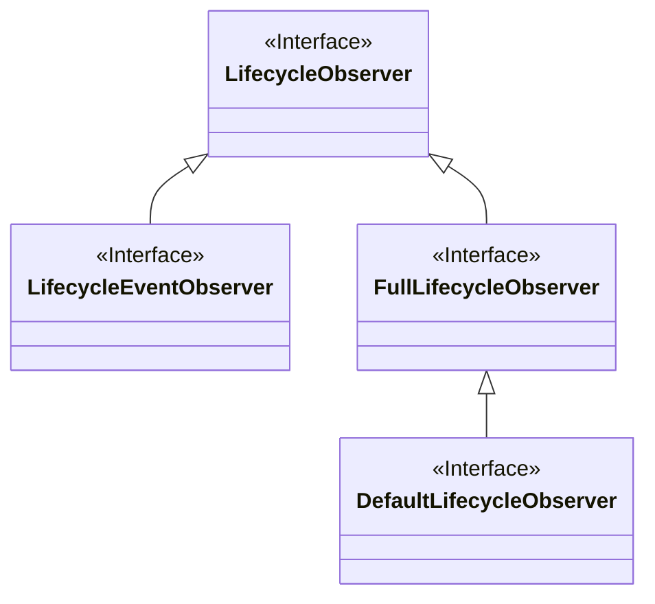

# AndroidX

[什么是AndroidX](https://blog.csdn.net/guolin_blog/article/details/97142065)

androidx命名空间包含了 Android Jetpack、以及重构了之前的 Support 库（28.0.0是最后一个版本了）等。AndroidX 中的库都会单独维护和更新。

## LifeCycle

```groovy
//单独依赖下述库时，Android Gradle插件会自动添加部分依赖

 //lifecycle-runtime-ktx
 //lifecycle-common
 //lifecycle-runtime
 implementation "androidx.lifecycle:lifecycle-runtime-ktx:$lifecycle_version"

 //lifecycle-viewmodel-ktx 
 //lifecycle-viewmodel
 implementation "androidx.lifecycle:lifecycle-viewmodel-ktx:$lifecycle_version"

 //lifecycle-livedata-ktx
 //lifecycle-livedata-core-ktx
 //lifecycle-livedata
 //lifecycle-livedata-core
 //lifecycle-common
 implementation "androidx.lifecycle:lifecycle-livedata-ktx:$lifecycle_version"

 //lifecycle-viewmodel-savedstate
 //lifecycle-viewmodel
 //lifecycle-livedata-core
 //lifecycle-common
 implementation "androidx.lifecycle:lifecycle-viewmodel-savedstate:$lifecycle_version"

 //添加此注解处理依赖，会为添加了@OnLifecycleEvent注解的类生成 xxx_LifecycleAdapter，这样就不用在运行的时候通过反射去回调
 //Lifecycle中的生命周期感知方法了
 kapt "androidx.lifecycle:lifecycle-compiler:$lifecycle_version"
 //Java8接口方法可以声明为default，用下面这个替代lifecycle-compiler，生命周期感知组件直接继承 DefaultLifecycleObserver
 //重写自己需要回调方法即可
 implementation "androidx.lifecycle:lifecycle-common-java8:$lifecycle_version"

 //自定义Service继承LifecycleService，实现Service生命周期感知组件
 implementation "androidx.lifecycle:lifecycle-service:$lifecycle_version"
 //应用进程生命周期感知，借助ProcessLifecycleOwnerInitializer(继承自ContentProvider)，来自动初始化ProcessLifecycleOwner，然后通过它来添加应用进程生命周期感知的组件
 implementation "androidx.lifecycle:lifecycle-process:$lifecycle_version"
```

### Lifecycle

[处理生命周期](https://developer.android.com/reference/androidx/lifecycle/ProcessLifecycleOwner?hl=zh-cn)


Lifecycle：具有Android组件生命周期的对象，LifecycleRegistry是其实现类


LifecycleOwner：实现getLifecycle()，返回真正的Lifecycle对象(LifecycleRegistry)


LifecycleObserver、LifecycleEventObserver、FullLifecycleObserver、DefaultLifecycleObserver



[从源码看 Jetpack（1） -Lifecycle源码解析](https://juejin.cn/post/6847902220755992589)

ReportFragment.injectIfNeededIn()，通过 registerActivityLifecycleCallbacks(SDK>=29) 或者 Fragment(SDK<29) 的生命周期回调方法来 dispatch Lifecycle.Event 事件，然后通过 LifecycleRegistry 的 handleLifecycleEvent() 处理 Lifecycle.Event 。外界传入的 LifecycleObserver 被统一包装为 ObserverWithState，Lifecycling又把 LifecycleObserver 统一转换成 LifecycleEventObserver 对象（isLifecycleEventObserver？？ isFullLifecycleObserver？？ apt中间生成类？？ 反射！！），最终通过LifecycleEventObserver 的 onStateChanged() 方法统一回调给外面。

### LiveData

[LiveData源码解析](https://github.com/leavesC/AndroidGuide/blob/gitbook/jetpack/LiveData%E6%BA%90%E7%A0%81%E8%A7%A3%E6%9E%90.md)

LiveData包含一个 SafeIterableMap 类型的 mObservers 变量，用来记录当前可观察的 Observer，其元素是 ObserverWrapper，当调用 LiveData 的 observe() 方法时，把传入的 Observer 封装为 LifecycleBoundObserver（继承自ObserverWrapper，实现了LifecycleEventObserver接口），通过 LifecycleOwner 来添加 LifecycleBoundObserver 的生命周期感知回调，所以可以在进入 DESTROY 状态时自动移除 Observer。

```java
observe -> LifecycleBoundObserver 
observeForever -> AlwaysActiveObserver

MutableLiveData: 将 Livedata 的 setValue() 和 postValue() 方法的访问权限提升为了 public
  
MediatorLiveData：中介LiveData，addSource添加其它的LiveData作为数据源
  
Transformations：利用 MediatorLiveData 进行 LiveData 的数据类型转换 map（类型转换为其他类型）、switchMap（类型转换为其他类型的LiveData）distinctUntilChanged（过滤重复值）
  
ComputableLiveData：带有生命周期监听、响应式的触发耗时任务、以 LiveData 作为中介获取任务执行结果
```

#### 粘性事件、数据倒灌：

`LiveData.observer()` 的时候，每一个 Observer 会有一个 `mLastVersion` 的字段，表示该 Observer 的数据版本，默认是 `START_VERSION`（-1），LiveData 本身也有个 `mVersion` 的字段，表示当前数据的版本。添加新 Observer 的时候，由于 mLastVersion 是 -1，如果 LiveData 之前设置过数据，则 mLastVersion < mVersion，所以会把数据粘性回调给新的 Observer。

解决办法：

* 添加新的 Observer 时 反射修改其 `mLastVersion` 为 `mVersion`
* 事件包装器


### ViewModel

[ViewModel源码解析](https://github.com/leavesC/AndroidGuide/blob/gitbook/jetpack/ViewModel%E6%BA%90%E7%A0%81%E8%A7%A3%E6%9E%90.md)

如何初始化？

```kotlin
//deprecated 
ViewModelProviders.of(mContext).get(MyViewModel::class.java)

//直接构造ViewModelProvider对象来获得ViewModel实例
ViewModelProvider(this).get<MyViewModel>() 
ViewModelProvider(this).get("key-str",MyViewModel::class.java) //指定ViewModelStore保存的Key
```

构造 ViewModelProvider 需要传 ViewModelStoreOwner（获取ViewModelStore实例）和一个 Factory 对象（用来构造ViewModel实例），ComponentActivity 和 Fargment 都实现了 ViewModelStoreOwner 接口，内部保存了一个 ViewModelStore 实例（内部是一个 hashMap 用来存储 ViewModel 实例，key为默认的DEFAULT_KEY `androidx.lifecycle.ViewModelProvider.DefaultKey`+`ViewModel`类的全限定名）。在 ActivityThread 的 performDestroyActivity() 方法里面，会调用 Activity 实例的 retainNonConfigurationInstances() 方法来保存一个 NonConfigurationInstances对象（lastNonConfigurationInstances：里面包含有当前的 ViewModelStore实例） ，由于配置发生改变重新创建Activity时，在 performLaunchActivity() 方法里面把 lastNonConfigurationInstances 重新赋值回去，所以确保Activity重新创建时（配置发生改变）能获取到上次使用的 ViewModel 实例。在Activity onDestroy回调时，判断是否由于配置改变导致的重建，如果不是，则正常 clear ViewModelStore 里面所有的 ViewModel 实例。

默认的几个 factory，不指定的话默认是 NewInstanceFactory，反射构造无参 ViewModel 实例；AndroidViewModelFactory，需要 ViewModel 有一个带有 Application 参数的构造函数；KeyedFactory，需要指定 ViewModelStore 保存 ViewModel 的Key。可以实现 HasDefaultViewModelProviderFactory 来指定 ViewModelStoreOwner 的默认 Factory。


### App StartUp

[从源码看 Jetpack（5）-Startup 源码详解](https://leavesc.gitbook.io/androidguide/jetpack-yuan-ma-bi-ji/startup-yuan-ma-xiang-jie)

### SavedStateHandle

[从源码看 Jetpack（7）-SavedStateHandle 源码解析](https://leavesc.gitbook.io/androidguide/jetpack-yuan-ma-bi-ji/savedstatehandle-yuan-ma-xiang-jie)


### WorkManager

JobScheduler  Android 5.0 添加，不属于AndroidX（放在这里做个比对）。通过获取到 JobSchduler 的系统服务，然后设置一些预定条件的 JobInfo，通过 schedule 方法把任务交给系统服务调度。Android 5.0之前，可以使用 FirebaseJobDispatcher、GcmNetworkManager （兼容到API 14）

[Android JobScheduler的使用和原理](https://www.jianshu.com/p/55e16941bfbd)

7.0之后，JobInfo的 setPeriodic 定时任务最小间隔时间为15min，可以通过 setMinimumLatency() 方法来做循环 schdule Job，做到小于 15min 的定时任务 

WorkManager 是 AndroidX 的组件， 支持的API级别为14，底层调度工作原理：


## 注解

### RestrictTo

[[RestrictTo not restricting usage of restricted method](https://stackoverflow.com/questions/53069908/restrictto-not-restricting-usage-of-restricted-method)](https://stackoverflow.com/questions/53069908/restrictto-not-restricting-usage-of-restricted-method)

指定被注解元素的使用范围，在Android Studio可以测试RestrictTo.Scope.SUBCLASSES，其它的 scope 需要把 module  编译成 maven library（通过groupid、artifactId区分）


