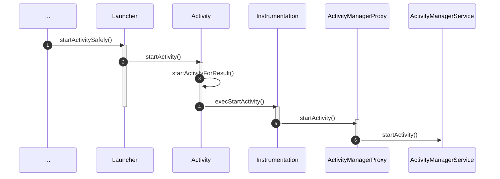
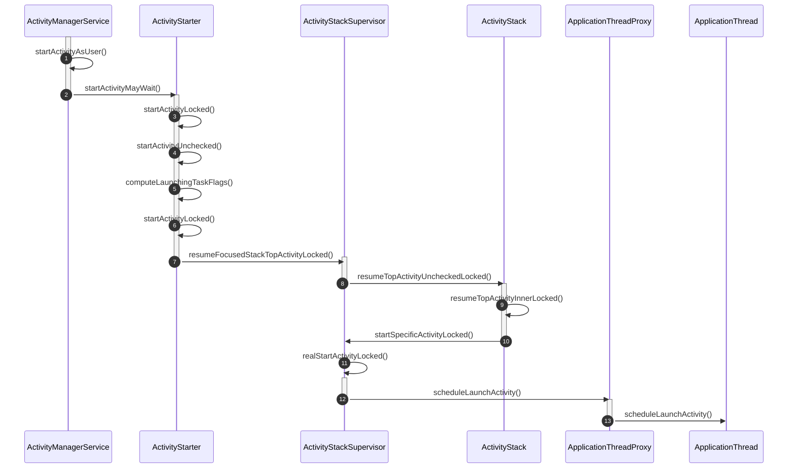
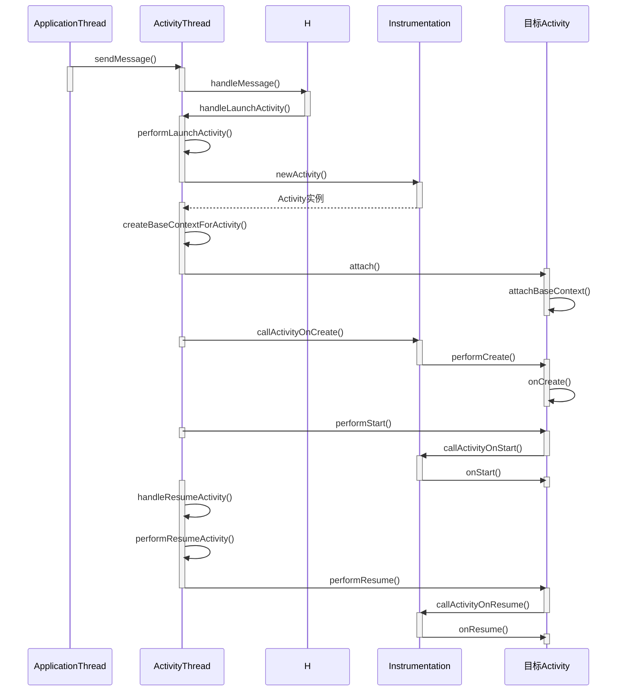
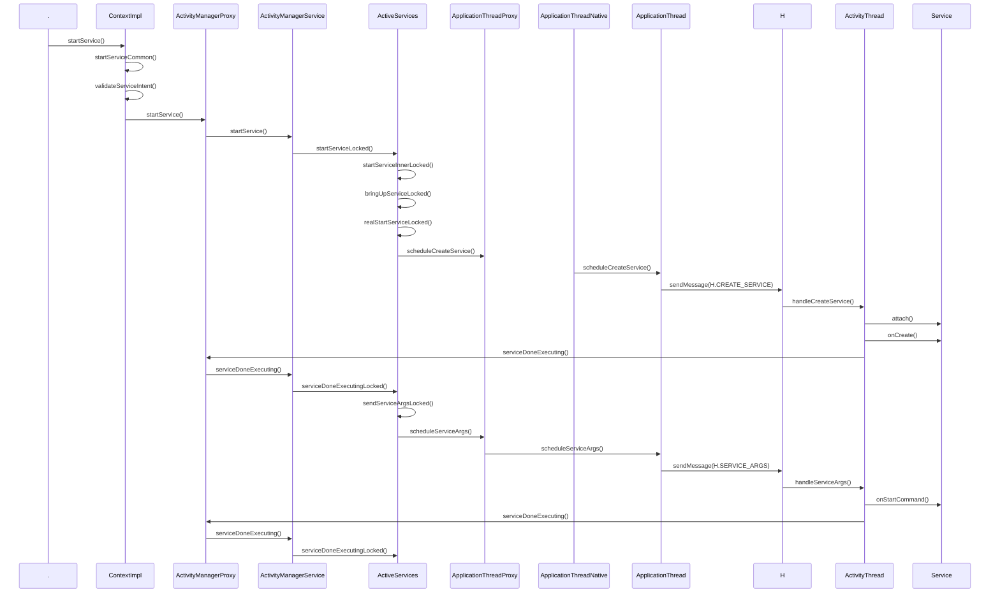
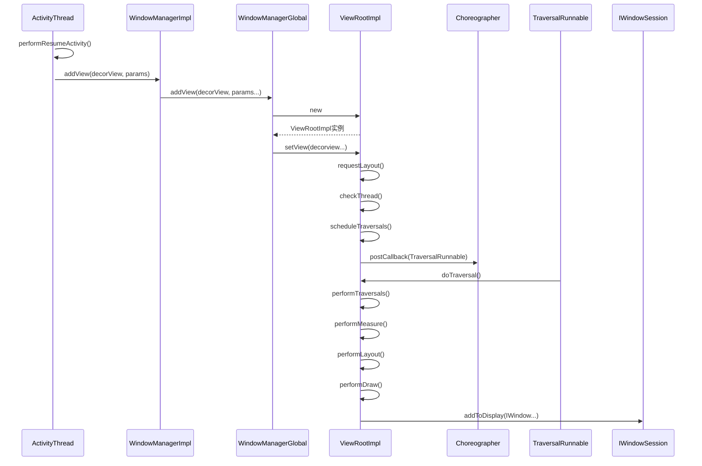

# Android源码

## Init进程的启动过程

[Android系统启动流程（一）解析init进程启动过程](http://liuwangshu.cn/framework/booting/1-init.html)

引导芯片代码 -> 加载Bootloader到RAM执行 -> Linux内核启动 -> init进程启动 init.cpp main()

* 创建一些文件夹并挂载设备
* property_init 初始化属性，start_property_service启动属性服务
* 解析 init.rc、init.zygote32(64).rc

-> builtins.cpp do_class_start() 

* fork 子进程
* app_main.cpp main()
* AndroidRuntime.start("com.android.internal.os.ZygoteInit",, args, zygote)

## Zygote进程启动

[Android系统启动流程（二）解析Zygote进程启动过程](http://liuwangshu.cn/framework/booting/2-zygote.html)

AndroidRuntime.start(）

* startVm() 启动 JavaVM(Dalvik、ART) 虚拟机
* startReg() 为虚拟机注册JNI
* 通过 JNI 调用 ZygoteInit.java 的 main()，从此进 Java 的世界

 ZygoteInit.java main()

* registerZygoteSocket(), 创建Server端的监听Socket
  * 创建sServerSocket (LocalServerSocket)  
* preload()，预加载一些常用的类和资源
* startSystemServer() 启动系统服务
  * Zygote.forkSystemServer() (uid gid设置为1000)
  * ZygoteInit.handleSystemServerProcess 启动SystemServer进程
* runSelectLoop() 等待客户端连接(AMS 请求 Zygote 创建新的应用程序进程)

## SystemServer进程启动

[Android系统启动流程（三）解析SyetemServer进程启动过程](http://liuwangshu.cn/framework/booting/3-syetemserver.html)

ZygoteInit.java startSystemServer()

* Zygote.forkSystemServer()： fork SystemServer进程
* handleSystemServerProcess() ：closeServerSocket()关闭从Zygote进程复制来的Socket；SystemServer进程启动之后的工作

RuntimeInit.zygoteInit：

* nativeZygoteInit()：
  * AndroidRuntime.cpp com_android_internal_os_RuntimeInit_nativeZygoteInit()
  * AppRuntime.onZygoteInit()
  * ProcessState.startThreadPool()：启动一个Binder线程池，这样SyetemServer进程就可以使用
Binder来与其他进程进行通信了
* applicationInit()


## Activity的启动过程

冷启动，点击 Launcher 应用图标进入 APP 时序图：

Instrumentation：类负责监控系统与应用之间的所有交互

ActivityManagerProxy: 即 *ActivityManagerNative.getDefault()* ，是 AMS 在应用进程的 Binder 代理对象。



* ActivityRecord：系统服务中的 Activity 实例
* TaskRecord：Activity任务栈，内部维护了一个 ActivityRecord 的列表
* ActivityStack：内部维护了一个 TaskRecord 的列表，方便管理所有的 TaskRecord；一般来说Launcher的Task属于单独的一个ActivityStack，称为mHomeStack，System UI如rencentActivity的Task属于一个单独ActivityStack，其他App的Task属于另一个ActivityStack
* ActivityManagerService：启动 Activity 的核心系统服务，ActivityStarter 负责启动，ActivityStackSupervisor 负责管理 ActivityStack，ActivityStack 负责管理 TaskRecord 和 ActivityRecord
* startActivityMayWait：通过 PMS 根据 Intent 获取 Activity 的启动信息 (ResolveInfo和ActivityInfo), 获取调用者的 Pid 和 Uid
* startActivityLocked： 创建ActivityRecord, 含有 Activity 的核心信息
* startActivityUnchecked：根据启动的 Flag 信息以及启动模式, 设置 TaskRecord, 完成后执行
* startSpecificActivityLocked：判断当前应用进程是否创建，没有创建则 AMS 跟 Zygote 通过 Socket 的方式新建进程
* scheduleLaunchActivity: 系统服务通过 Binder 代理对象 ApplicationThreadProxy 远程调用应用进程的 ApplicationThread（ActivityThread的内部类）


* ApplicationThread接收到 AMS 的远程调用，然后把事件抛给 ActivityThread 的 H（Handler）对象，H.handleMessage() 调用 ActivityThread 的方法（例如 handleLaunchActivity()）顺序处理这些事件，并最终通过 Instrumentation 依次回调目标 Activity 的生命周期方法
* createBaseContextForActivity: 创建 ContextImpl 对象，
* Activity.sttach(): 内部调用 Activity（ContextThemeWrapper）的 attachBaseContext() 方法，将创建的 ContextImpl  对象设置为 Activity（ContextWrapper）的 mBase 属性；内部创建 PhoneWindow 对象



## setContentView()


Activity 的 setContentView() 会调用 PhoneWindow 的 setContentView() 方法

PhoneWindow.setContentView()

```java
public void setContentView(int layoutResID) {
        // Note: FEATURE_CONTENT_TRANSITIONS may be set in the process of installing the window
        // decor, when theme attributes and the like are crystalized. Do not check the feature
        // before this happens.
        if (mContentParent == null) {
            //mContentParent即为id为 android.R.id.content 的ViewGroup
            installDecor();
        } else if (!hasFeature(FEATURE_CONTENT_TRANSITIONS)) {
            mContentParent.removeAllViews();
        }

        if (hasFeature(FEATURE_CONTENT_TRANSITIONS)) {
            final Scene newScene = Scene.getSceneForLayout(mContentParent, layoutResID,
                    getContext());
            transitionTo(newScene);
        } else {
            //将我们指定的 layoutResId inflate 到 mContentParent
            mLayoutInflater.inflate(layoutResID, mContentParent);
        }
        mContentParent.requestApplyInsets();
        final Callback cb = getCallback();
        if (cb != null && !isDestroyed()) {
            //回调 onContentChanged()
            cb.onContentChanged();
        }
        mContentParentExplicitlySet = true;
    }
```

PhoneWindow.installDecor()

```java
private void installDecor() {
        mForceDecorInstall = false;
        if (mDecor == null) {
            //创建 PhoneWindow 里面的 DecorView 对象
            mDecor = generateDecor(-1);
            mDecor.setDescendantFocusability(ViewGroup.FOCUS_AFTER_DESCENDANTS);
            mDecor.setIsRootNamespace(true);
            if (!mInvalidatePanelMenuPosted && mInvalidatePanelMenuFeatures != 0) {
                mDecor.postOnAnimation(mInvalidatePanelMenuRunnable);
            }
        } else {
            mDecor.setWindow(this);
        }
        if (mContentParent == null) {
            //获取 DecorView 中 id 为 android.R.id.content 的 Viewgroup
            mContentParent = generateLayout(mDecor);
            
            ......
              
        }
    }
```

PhoneWindow.generateDecor()

```java
protected DecorView generateDecor(int featureId) {
        // System process doesn't have application context and in that case we need to directly use
        // the context we have. Otherwise we want the application context, so we don't cling to the
        // activity.
        Context context;
        if (mUseDecorContext) {
            Context applicationContext = getContext().getApplicationContext();
            if (applicationContext == null) {
                context = getContext();
            } else {
                context = new DecorContext(applicationContext, getContext().getResources());
                if (mTheme != -1) {
                    context.setTheme(mTheme);
                }
            }
        } else {
            context = getContext();
        }
        //New 根布局 DecorView
        return new DecorView(context, featureId, this, getAttributes());
    }
```

PhoneWindow.generateLayout()

```java
protected ViewGroup generateLayout(DecorView decor) {
        // 处理主题的各种窗口属性、Flag，一大段逻辑
        TypedArray a = getWindowStyle();

        ......

        mIsFloating = a.getBoolean(R.styleable.Window_windowIsFloating, false);
        int flagsToUpdate = (FLAG_LAYOUT_IN_SCREEN|FLAG_LAYOUT_INSET_DECOR)
                & (~getForcedWindowFlags());
        if (mIsFloating) {
            setLayout(WRAP_CONTENT, WRAP_CONTENT);
            setFlags(0, flagsToUpdate);
        } else {
            setFlags(FLAG_LAYOUT_IN_SCREEN|FLAG_LAYOUT_INSET_DECOR, flagsToUpdate);
        }

        if (a.getBoolean(R.styleable.Window_windowNoTitle, false)) {
            requestFeature(FEATURE_NO_TITLE);
        } else if (a.getBoolean(R.styleable.Window_windowActionBar, false)) {
            // Don't allow an action bar if there is no title.
            requestFeature(FEATURE_ACTION_BAR);
        }
        ......
          
        // Inflate the window decor.
        // DecorView 根据上面主题解析得到的各种属性、Flag，获取对应布局
        int layoutResource;
        int features = getLocalFeatures();
        if ((features & (1 << FEATURE_SWIPE_TO_DISMISS)) != 0) {
            layoutResource = R.layout.screen_swipe_dismiss;
        } else if ((features & ((1 << FEATURE_LEFT_ICON) | (1 << FEATURE_RIGHT_ICON))) != 0) {
            if (mIsFloating) {
                TypedValue res = new TypedValue();
                getContext().getTheme().resolveAttribute(
                        R.attr.dialogTitleIconsDecorLayout, res, true);
                layoutResource = res.resourceId;
            } else {
                layoutResource = R.layout.screen_title_icons;
            }
            // XXX Remove this once action bar supports these features.
            removeFeature(FEATURE_ACTION_BAR);
            // System.out.println("Title Icons!");
        } else if ((features & ((1 << FEATURE_PROGRESS) | (1 << FEATURE_INDETERMINATE_PROGRESS))) != 0
                && (features & (1 << FEATURE_ACTION_BAR)) == 0) {
            // Special case for a window with only a progress bar (and title).
            // XXX Need to have a no-title version of embedded windows.
            layoutResource = R.layout.screen_progress;
            // System.out.println("Progress!");
        } 
        
        ......

        mDecor.startChanging();
        //DecorView 添加对应布局的 View
        mDecor.onResourcesLoaded(mLayoutInflater, layoutResource);
        //获取 id 为 android.R.id.content 的 ViewGroup
        ViewGroup contentParent = (ViewGroup)findViewById(ID_ANDROID_CONTENT);
        if (contentParent == null) {
            throw new RuntimeException("Window couldn't find content container view");
        }

        ......

        return contentParent;
    }
```

至此，Activity 的 setContentView() 就完毕了，首先通过 PhoneWindow 来创建根布局 DecorView，然后 DecorView 根据 Activity 主题的不同属性和窗口功能来添加对应布局的View，最后在DecorView 中 id 为 android.R.id.content 的 ViewGroup 里面 inflate 我们指定的布局 id。


## Service的启动过程

Application 跟 Activity 的 `startService()` 都继承自 ContextImpl，以下为启动 Service 的时序图：


ContextImpl.validateServiceIntent(): 检查 Intent 是否显示指定 Service 组件，Android L 之后不允许隐式启动 Service。


## View绘制流程

Activity创建之后，调用 attch() 方法：

```java
final void attach(Context context, ActivityThread aThread,
            Instrumentation instr, IBinder token, int ident,
            Application application, Intent intent, ActivityInfo info,
            CharSequence title, Activity parent, String id,
            NonConfigurationInstances lastNonConfigurationInstances,
            Configuration config, String referrer, IVoiceInteractor voiceInteractor,
            Window window) {
        attachBaseContext(context);

        ......

        //创建PhoneWindow
        mWindow = new PhoneWindow(this, window);
        mWindow.setWindowControllerCallback(this);
        mWindow.setCallback(this);
        mWindow.setOnWindowDismissedCallback(this);
        
        ......

        //设置mWindowManager
        mWindow.setWindowManager(
                (WindowManager)context.getSystemService(Context.WINDOW_SERVICE),
                mToken, mComponent.flattenToString(),
                (info.flags & ActivityInfo.FLAG_HARDWARE_ACCELERATED) != 0);
        if (mParent != null) {
            mWindow.setContainer(mParent.getWindow());
        }
        mWindowManager = mWindow.getWindowManager();
        ......
    }
```

* ViewRootImpl创建时会通过 WindowManagerGlobal.getWindowSession() 获取 WindowSession 对象（WMS 的 openSession() 方法）
*  一个ViewRootImpl 对象对应着一次 WindowManager.addView 中的View，并管理着这个 View 树的测量布局和绘制等工作，通过 WindowSession 对象与 WMS 交互


## ANR

### 触发原理

#### Service

启动或者绑定 Service 时，一个生命周期流程（APP进程和System_Server进程交互）create、start、bind 等，每个周期都会在 AMS 中记录一个超时时间，前台服务为 20s，后台服务为 200s，如果超出时间还没有处理完，则会出发 ANR 事件。

举例，记录 Service 创建即 create 周期超时的调用在 AMS 的 `realStartServiceLocked` 方法中：

```java
    private final void realStartServiceLocked(ServiceRecord r,
            ProcessRecord app, boolean execInFg) throws RemoteException {
        ......
        //Service创建超时记录
        bumpServiceExecutingLocked(r, execInFg, "create");
        ......
        try {
            ......
            app.thread.scheduleCreateService(r, r.serviceInfo,
                    mAm.compatibilityInfoForPackageLocked(r.serviceInfo.applicationInfo),
                    app.repProcState);
            ......
        } catch (DeadObjectException e) {
            ......
        } finally {
            ......
        }
        ......
    }
```

`bumpServiceExecutingLocked`

```java
private final void bumpServiceExecutingLocked(ServiceRecord r, boolean fg, String why) {
        ......
        if (r.executeNesting == 0) {
            r.executeFg = fg;
            ServiceState stracker = r.getTracker();
            if (stracker != null) {
                stracker.setExecuting(true, mAm.mProcessStats.getMemFactorLocked(), now);
            }
            if (r.app != null) {
                r.app.executingServices.add(r);
                r.app.execServicesFg |= fg;
                if (r.app.executingServices.size() == 1) {
                   //前台服务？？？
                    scheduleServiceTimeoutLocked(r.app);
                }
            }
        } else if (r.app != null && fg && !r.app.execServicesFg) {
            r.app.execServicesFg = true;
            //后台服务？？？
            scheduleServiceTimeoutLocked(r.app);
        }
        ......
    }
```

`scheduleServiceTimeoutLocked`

```java
void scheduleServiceTimeoutLocked(ProcessRecord proc) {
        if (proc.executingServices.size() == 0 || proc.thread == null) {
            return;
        }
        long now = SystemClock.uptimeMillis();
        Message msg = mAm.mHandler.obtainMessage(
                ActivityManagerService.SERVICE_TIMEOUT_MSG);
        msg.obj = proc;
        //前台服务20s，后台服务是它的10倍
        mAm.mHandler.sendMessageAtTime(msg,
                proc.execServicesFg ? (now+SERVICE_TIMEOUT) : (now+ SERVICE_BACKGROUND_TIMEOUT));
    }
```

如果在超时时间内完成了操作，即移除掉超时消息，在 AMS 的 `serviceDoneExecutingLocked` 方法中

```java
private void serviceDoneExecutingLocked(ServiceRecord r, boolean inDestroying,
            boolean finishing) {
        ......
        if (r.executeNesting <= 0) {
            if (r.app != null) {
                r.app.execServicesFg = false;
                r.app.executingServices.remove(r);
                if (r.app.executingServices.size() == 0) {
                    //当前服务所在进程中没有正在执行的service
                    mAm.mHandler.removeMessages(ActivityManagerService.SERVICE_TIMEOUT_MSG, r.app);
                }
           ......
        }
    }
```

如果超时时间内没有完成，则在 AMS 的 MainHandler 处理该超时消息：

```java
final class MainHandler extends Handler {
    public void handleMessage(Message msg) {
        switch (msg.what) {
            case SERVICE_TIMEOUT_MSG: {
                ......
                mServices.serviceTimeout((ProcessRecord)msg.obj);
            } break;
            ......
        }
        ......
    }
}
```

`ActiveServices.serviceTimeout`

```java
void serviceTimeout(ProcessRecord proc) {
        String anrMessage = null;
        ......
        if (anrMessage != null) {
            //触发ANR
            mAm.mAppErrors.appNotResponding(proc, null, null, false, anrMessage);
        }
    }
```

### BroadcastReceiver

BroadcastQueue.BroadcastHandler 收到`BROADCAST_TIMEOUT_MSG`消息时触发

对于广播队列有两个: foreground 队列和 background 队列:

- 对于前台广播，则超时为BROADCAST_FG_TIMEOUT = 10s；
- 对于后台广播，则超时为BROADCAST_BG_TIMEOUT = 60s

### ContentProvider

AMS.MainHandler收到 `CONTENT_PROVIDER_PUBLISH_TIMEOUT_MSG` 消息时触发, 超时时间为 `CONTENT_PROVIDER_PUBLISH_TIMEOUT = 10s`,跟前面的Service和BroadcastQueue完全不同, 由Provider[进程启动](http://gityuan.com/2016/10/09/app-process-create-2/)过程相关

### input事件

[Input系统—启动篇](http://gityuan.com/2016/12/10/input-manager/)

Input模块的主要组成：

- ；
- Native层的InputDispatcher接收来自InputReader的输入事件，并记录WMS的窗口信息，用于派发事件到合适的窗口；
- Java层的InputManagerService跟WMS交互，WMS记录所有窗口信息，并同步更新到IMS，为InputDispatcher正确派发事件到ViewRootImpl提供保障；

1. Native层的InputReader负责从EventHub取出事件并处理，再交给InputDispatcherInputDispatcher中会启动一个Thread,这个thread在threadLoop()中调用dispatchOnce检查EventHub从 /dev/input 的设备结点中是否有事件传递过来，
2. 当有事件过来后，会根据focus 来找到对应window 处理key,touch 或者其它事件。
3. 在事件产生时记录一个 timestamp,之后处理的时候再记录一个timestamp，那么如果时间差大于 INPUT_TIMEOUT 或者 SERVICE_TIMEOUT，那么就会报ANR问题了。

